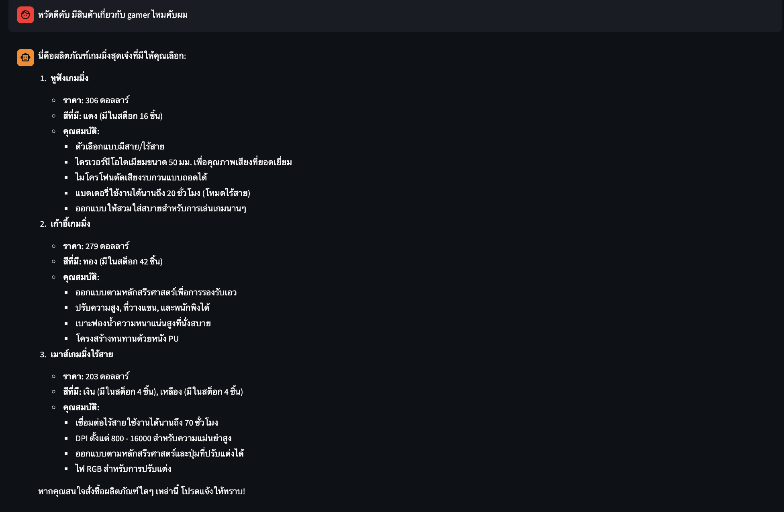
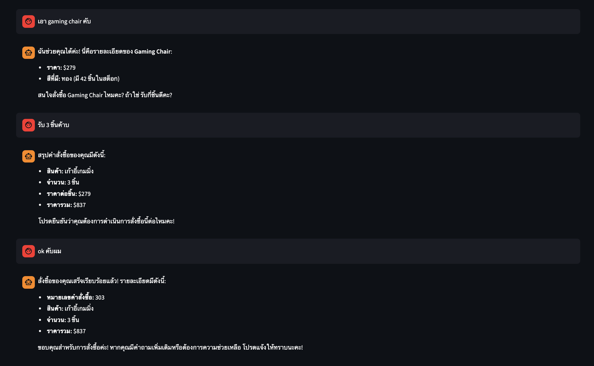
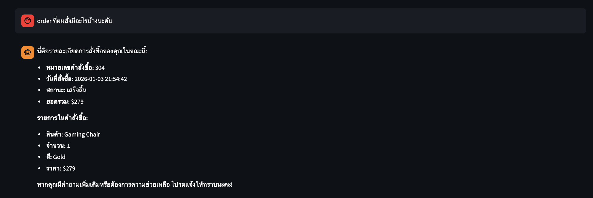
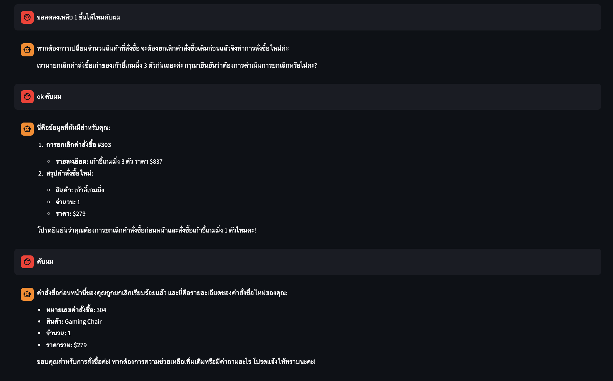
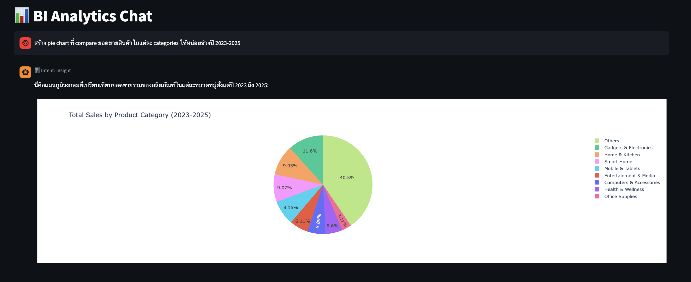
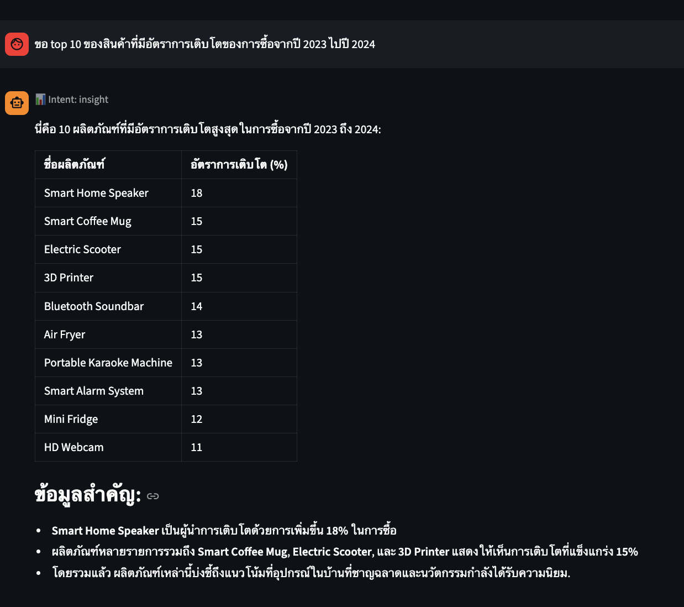
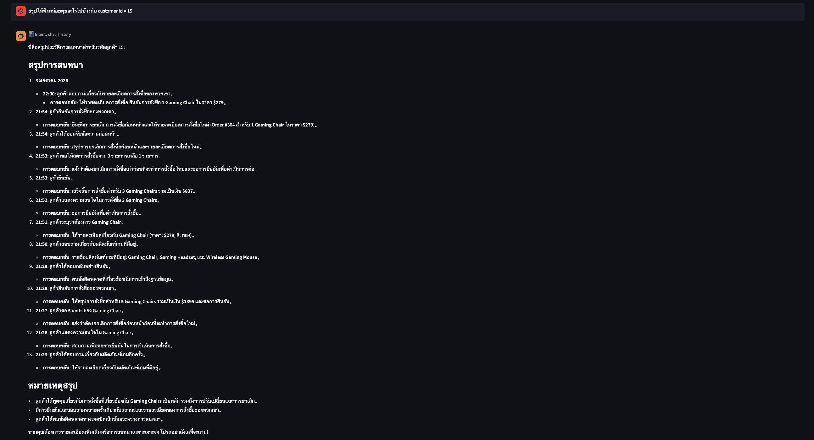

# **🤖 ERP Multi-Agent System**

<mark>AI-powered ERP assistant</mark> using LiteLLM, LangGraph, and Qdrant for <mark>product/order queries</mark>.


---


## **📑 Table of Contents**

- [Use Cases](#-use-cases)
- [Architecture](#-architecture)
- [Tech Stack](#-tech-stack)
- [Quick Start](#-quick-start)
- [How to Use](#-how-to-use)
- [Project Structure](#-project-structure)
- [Documentation](#-documentation)


---


## **💼 Use Cases**

> 💡 **Tip:** For detailed usage instructions, see [Guides](docs/guides/README.md).


### 👤 **Customer Chatbot**

End customers can interact with the system to search products, place orders, view order history, and cancel orders.

**1️⃣ Product Search** - Search products using natural language with semantic search



**2️⃣ Place Order** - Order products through conversational interface



**3️⃣ View Orders** - Check order status and history



**4️⃣ Cancel Order** - Cancel pending orders




### 📊 **Client Chatbot (Internal BI)**

Business analysts can query analytics data, generate charts, and search customer conversations.

**1️⃣ Analytics with Charts** - Generate SQL queries and Plotly visualizations



**2️⃣ Analytics without Charts** - Get data insights in table format



**3️⃣ Customer Chat Lookup** - Search and analyze customer conversations




---


## **🏗️ Architecture**


---


## **🛠️ Tech Stack**

| Category | Technology |
|----------|------------|
| LLM Gateway | LiteLLM (OpenAI-compatible) |
| Agent Framework | LangGraph |
| Vector Database | Qdrant (hybrid search) |
| API Framework | FastAPI |
| UI Framework | Streamlit |
| Configuration | Dynaconf |
| Observability | Langfuse |
| Databases | SQLite (ERP), PostgreSQL (memory), Redis (checkpointer) |


---


## **🚀 Quick Start**

### 📋 **Prerequisites**

> ⚠️ **Important:** Ensure you have the following installed before proceeding.

- Docker & Docker Compose
- Python 3.10+
- OpenAI API key


### ⚡ **Setup**

**1️⃣ Setup environment**

```bash
cp .env.template .env
# Edit .env with your OPENAI_API_KEY
```

**2️⃣ Install dependencies**

```bash
python -m venv .venv  # first time only
source .venv/bin/activate
pip install -r requirements.txt
```

**3️⃣ Start services** (includes API and UI)

```bash
docker-compose up -d
```

**4️⃣ Run database migrations**

```bash
./scripts/run_migrations.sh
```

**5️⃣ Ingest knowledge base**

```bash
python scripts/ingest_pdfs.py
```

**6️⃣ Upload prompts** (optional)

```bash
python scripts/upload_prompts.py
```

> 📝 **Note:** For detailed setup instructions, see [Setup Guide](docs/infrastructure/setup/README.md).


---


## **🎯 How to Use**

### 1️⃣ **API**

| Method | Endpoint | Description |
|--------|----------|-------------|
| GET | `/health` | Health check |
| POST | `/api/v1/chatbot/customer/chat` | Customer chatbot |
| POST | `/api/v1/chatbot/client/chat` | Client chatbot |

**Example:**

```bash
# Customer chatbot
curl -X POST http://localhost:8000/api/v1/chatbot/customer/chat \
  -H "Content-Type: application/json" \
  -d '{"query": "มีสินค้าอะไรบ้าง", "customer_id": "C001", "thread_id": "test-123"}'

# Client chatbot (internal BI)
curl -X POST http://localhost:8000/api/v1/chatbot/client/chat \
  -H "Content-Type: application/json" \
  -d '{"query": "แสดงยอดขายรายเดือน", "thread_id": "test-456"}'
```

> 📖 See [API Documentation](docs/multi-agent-systems/api/README.md) for more details.


### 2️⃣ **UI**

| App | URL | Description |
|-----|-----|-------------|
| Customer UI | http://localhost:8501 | Streamlit customer chatbot |
| Client UI | http://localhost:8502 | Streamlit BI analytics |

> 📖 See [UI Documentation](docs/multi-agent-systems/ui/README.md) for more details.


---


## **📁 Project Structure**

```
├── src/
│   ├── api/                 # FastAPI routes and schemas
│   ├── dependencies/        # Dependency injection
│   ├── usecases/            # Business logic
│   ├── repositories/        # Data access layer
│   └── modules/
│       ├── agents/          # LangGraph agents
│       ├── tools/           # LangChain tools
│       └── workflows/       # LangGraph workflows
├── libs/                    # Reusable libraries
├── configs/                 # YAML configuration files
├── prompts/                 # Langfuse prompts
├── evaluation/              # LLM-as-Judge evaluation
└── data/                    # SQLite database and PDFs
```


---


## **📚 Documentation**

| | | |
|:---:|:---:|:---:|
| [🤖 **Multi-Agent Systems**](docs/multi-agent-systems/README.md)<br/>Agents, tools, workflows | [🏗️ **Architecture**](docs/architecture/README.md)<br/>Code architecture and layers | [📝 **Decisions**](docs/decisions/README.md)<br/>Architecture decision records |
| [🔧 **Infrastructure**](docs/infrastructure/README.md)<br/>Docker services, setup guides | [📦 **Libs**](docs/libs/README.md)<br/>Reusable libraries | [💬 **Prompts**](docs/prompts/README.md)<br/>Prompt management with Langfuse |
| [🧪 **Evaluation**](docs/evaluation/README.md)<br/>Testing and LLM-as-Judge | [🔮 **Future**](docs/future_improvements/README.md)<br/>Potential enhancements | [📖 **Full Docs**](docs/README.md)<br/>Complete documentation |
