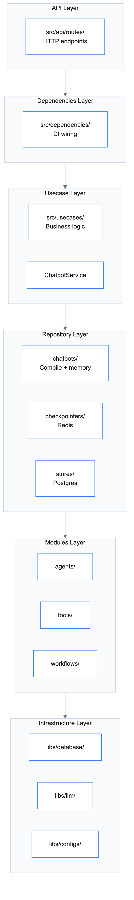

# Code Architecture

## Architecture Pattern

**Clean Architecture** with Repository Pattern and Dependency Injection.

| Pattern | Purpose |
|---------|---------|
| Clean Architecture | Layered separation of concerns |
| Repository Pattern | Abstract data access |
| Dependency Injection | Decouple components via `src/dependencies/` |
| Selector Pattern | Swap infrastructure providers easily |

## Layer Diagram

View Layer Architecture

## Layers

| Layer | Location | Responsibility |
|-------|----------|----------------|
| API | `src/api/` | HTTP endpoints, request/response |
| Dependencies | `src/dependencies/` | DI wiring, service initialization |
| Usecase | `src/usecases/` | Business logic orchestration |
| Repository | `src/repositories/` | Chatbots, checkpointers, stores |
| Modules | `src/modules/` | Agents, Tools, Workflows |
| Infrastructure | `libs/` | Generic clients, configs |

## Repository Layer

| Folder | Purpose |
|--------|---------|
| `chatbots/` | Compile workflow + manage memory (invoke, get_history) |
| `checkpointers/` | Short-term memory (Redis) - per thread, TTL-based |
| `stores/` | Long-term memory (Postgres) - cross thread, permanent |

## Modules Layer

| Folder | Purpose |
|--------|---------|
| `agents/` | AI agents (TranslationAgent, ProductAgent) |
| `tools/` | LangChain tools (SQLTool, ProductSearchTool) |
| `workflows/` | LangGraph workflows (uncompiled graph definitions) |

## Workflow vs Repository

| Component | Location | Responsibility |
|-----------|----------|----------------|
| Workflow | `src/modules/workflows/` | Define graph structure (nodes, edges) |
| ChatbotRepository | `src/repositories/chatbots/` | Compile graph with checkpointer + store |

Workflows define business logic but don't compile. Repositories handle memory management and compilation.

## libs/ vs repository/

| Layer | Scope | Reusability | Example |
|-------|-------|-------------|---------|
| `libs/` | Generic infrastructure | Cross-project | `SQLiteClient`, `QdrantClient`, `RedisClient` |
| `repository/` | Domain-specific | Project-specific | `CustomerChatbotRepository`, `RedisCheckpointerRepository` |
