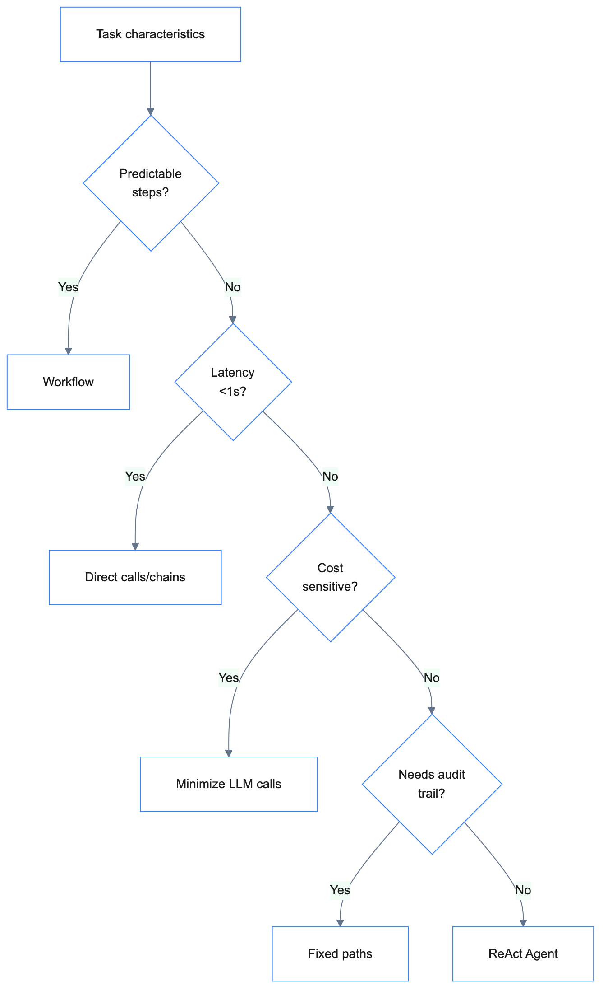

# Why ReAct Agent Pattern for ProductAgent

## Decision

Use LangChain v1's `create_agent` (ReAct pattern) for ProductAgent instead of a custom router with separate nodes.

## Context

ProductAgent handles multiple product-related queries:
- Search products by name/description
- Find similar products (recommendations)
- Compare products
- Check stock/price

We considered two approaches:

### Option 1: Router + Separate Nodes

```
Router → [search_node, recommend_node, compare_node, stock_node]
```

- Explicit routing logic
- Separate prompt for each node
- More control but more code

### Option 2: Single ReAct Agent

```
ReAct Agent → dynamically chooses tools
```

- LLM decides which tools to use
- Single system prompt
- Handles multi-step queries naturally

## Decision

Chose **Option 2: Single ReAct Agent** using LangChain v1 `create_agent`.

## Rationale

1. **Simpler Architecture**: One agent instead of router + 4 nodes
2. **Multi-step Queries**: ReAct naturally handles "search then check stock" queries
3. **Tool Composition**: LLM can combine multiple tools in one query
4. **Maintainability**: Single prompt to maintain instead of 5 separate prompts
5. **LangChain v1 Support**: Built on LangGraph with middleware support for extensibility

## Trade-offs

| Aspect | ReAct | Router + Nodes |
|--------|-------|----------------|
| Complexity | Lower | Higher |
| Control | LLM decides | Explicit routing |
| Multi-step | Natural | Requires orchestration |
| Debugging | Harder (LLM reasoning) | Easier (explicit flow) |
| Token usage | Higher (reasoning steps) | Lower |

## When NOT to Use ReAct

ReAct agents are non-deterministic—the LLM decides tool calls, order, and termination. Use fixed workflows (LangGraph graphs) instead when:

| Scenario | Why ReAct Fails | Use Instead |
|----------|-----------------|-------------|
| Fixed sequence (data → validate → transform → store) | LLM might loop, skip steps, or hallucinate order | Sequential workflow with fixed nodes/edges |
| Real-time/low-latency (<500ms response) | Multiple LLM calls = 2-10s latency | Direct tool calls or simple chains |
| Cost-sensitive (high volume) | Unpredictable LLM iterations = high token cost | Single-shot prompts or rule-based logic |
| Regulated (finance/healthcare) | Non-deterministic = audit/compliance issues | Deterministic workflows with explicit logging |
| Simple tasks (single API call) | Overkill—LLM reasoning adds latency/cost | Direct function call |

### Decision Framework

<details>
<summary>View Decision Framework</summary>



</details>

**Rule of thumb**: If you can draw the flow as a flowchart with fixed steps → use workflow. If the LLM needs to discover/adapt → use ReAct.

### Example Comparison

```python
# ❌ BAD: ReAct for fixed ETL pipeline (unpredictable cost/latency)
agent = create_agent(model, [fetch_data, validate, transform, store])

# ✅ GOOD: Fixed workflow (predictable, fast, auditable)
from langgraph.graph import StateGraph, START, END

workflow = StateGraph(State)
workflow.add_edge(START, "fetch_data")
workflow.add_edge("fetch_data", "validate")
workflow.add_edge("validate", "transform") 
workflow.add_edge("transform", "store")
workflow.add_edge("store", END)
```

### Why ProductAgent Uses ReAct

ProductAgent is appropriate for ReAct because:
- Queries are **open-ended** ("หาลำโพงแล้วเช็คสต็อก" requires discovering which tools to use)
- User intent is **unpredictable** (search? compare? recommend?)
- **Multi-step reasoning** is needed (search → filter → check stock)
- Latency is acceptable for customer chatbot use case

**Note**: 80% of production use cases are predictable enough for workflows. Reserve ReAct for truly open-ended research/planning tasks.

## Implementation

```python
from langchain.agents import create_agent

agent = create_agent(
    model=llm,
    tools=[product_search, similar_products, sql_tool],
    system_prompt=system_prompt,  # from Langfuse
)
```

## Dependencies

- `langchain>=1.0.0` - provides `create_agent`
- `langgraph>=1.0.0` - runtime for ReAct agent

## References

- [LangChain v1.0 Announcement](https://blog.langchain.com/langchain-langgraph-1dot0/)
- [ReAct Agent from Scratch](https://langchain-ai.github.io/langgraph/how-tos/react-agent-from-scratch/)
- [Workflows vs Agents](https://langchain-ai.github.io/langgraph/concepts/agentic_concepts/)
- [Multi-agent Patterns](https://langchain-ai.github.io/langgraph/concepts/multi_agent/)
- [Subagents](https://langchain-ai.github.io/langgraph/how-tos/subgraph/)
