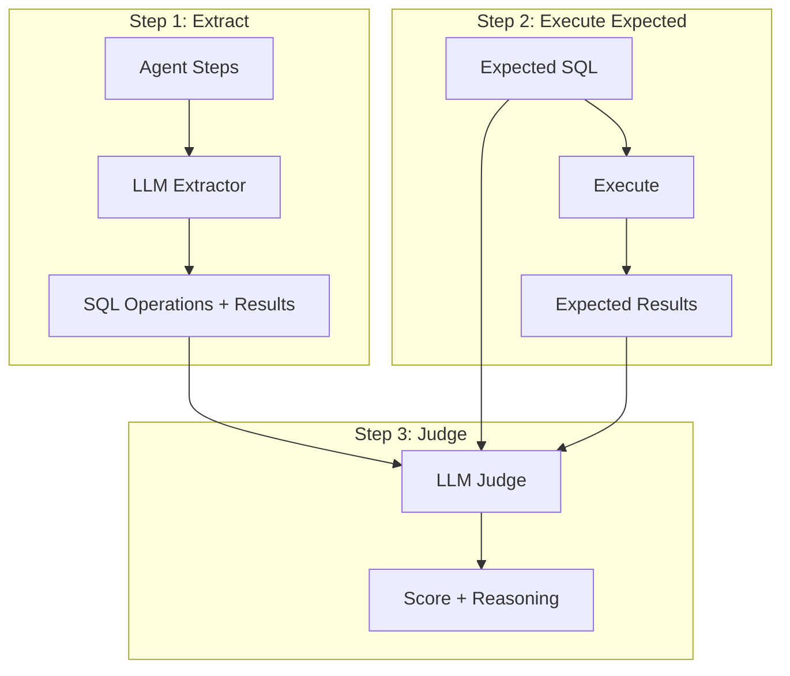

# SQLJudge Design Decision

## Context

We need to evaluate whether the SQL queries generated by the agent are correct.

## Options Considered

### Option A: Code-based comparison (execute and compare results)

```
1. Execute generated SQL
2. Execute expected SQL
3. Compare row counts and content programmatically
```

**Pros:**
- Fast, deterministic
- No LLM cost

**Cons:**
- Can't handle semantic equivalence (e.g., different column order, same data)
- Brittle to minor differences

### Option B: LLM compares SQL queries (no execution)

```
1. Send generated SQL + expected SQL + schema to LLM
2. LLM evaluates semantic equivalence
```

**Pros:**
- Understands semantic equivalence
- No database connection needed

**Cons:**
- LLM may hallucinate query results
- Can't verify actual execution correctness

### Option C: Execute expected + LLM compares

```
1. Extract SQL operations from agent steps using LLM (includes execution results from agent)
2. Execute expected SQL to get expected results
3. Send expected SQL, expected results, and extracted operations to LLM
4. LLM evaluates result match and efficiency
```

**Pros:**
- Accurate - compares expected results with agent's actual results
- Handles semantic equivalence
- Can evaluate efficiency
- Extracted operations already contain results from agent execution

**Cons:**
- Requires database connection for expected SQL
- LLM cost

## Decision

**Option C: Execute expected + LLM compares**

## Rationale

1. **2-step approach** - LLM extracts SQL operations from agent steps, then LLM judges correctness
2. **Expected results as ground truth** - Execute expected SQL to get ground truth results
3. **Agent results from steps** - Extracted operations include results from agent's execution
4. **Sub-scores** - Provides detailed feedback on result match and efficiency

## Scoring

| Sub-score | Weight | Description |
|-----------|--------|-------------|
| Result Match | 70% | Do agent results match expected results? |
| Efficiency | 30% | Is the SQL efficient? |

## Flow



## Negative Cases

For negative test cases (expected `sql: "null"`):
- Pass if no SQL operations found
- Fail if SQL was generated when it shouldn't be

## Implementation

- Extractor prompt: `evaluation_extractors_sql_extractor`
- Judge prompt: `evaluation_judges_sql_judge`
- Model: GPT-4o (configured in eval config)

## References

- [`evaluation/judges/sql/main.py`](../../evaluation/judges/sql/main.py)
