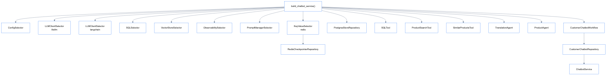

# Dependencies

Dependency injection wiring layer.

## Location

`src/dependencies/`

## Overview

Dependencies layer creates and wires all components together. Each file provides a `build_*_service()` function that returns a ready-to-use service.

## Available Dependencies

| File | Function | Returns |
|------|----------|---------|
| `customer_chatbot.py` | `build_chatbot_service()` | `ChatbotService` |

## build_chatbot_service()

Creates the customer chatbot service with all dependencies:

```python
from src.dependencies.customer_chatbot import build_chatbot_service

service = build_chatbot_service()
result = service.chat("หาลำโพง", "thread-123", "user-456")
```

## Dependency Graph

<details>
<summary>View Dependency Graph</summary>



</details>

## Config Loading

Dependencies read from `configs/agents/`:

| Config File | Purpose |
|-------------|---------|
| `shared.yaml` | LLM, database, observability settings |
| `customer_chatbot.yaml` | Chatbot-specific settings |

## Adding New Chatbot

To add a new chatbot type (e.g., SupportChatbot):

1. Create workflow: `src/modules/workflows/support_chatbot/`
2. Create repository: `src/repositories/chatbots/support/`
3. Create dependency: `src/dependencies/support_chatbot.py`
4. Create config: `configs/agents/support_chatbot.yaml`

```python
# src/dependencies/support_chatbot.py
def build_support_service() -> ChatbotService:
    # ... wire dependencies
    return ChatbotService(support_repo)
```

## References

- [Usecases](../usecases/README.md) - Business logic layer
- [Repositories](../repositories/README.md) - Data access layer
- [Architecture](../architecture/code.md) - Overall architecture
