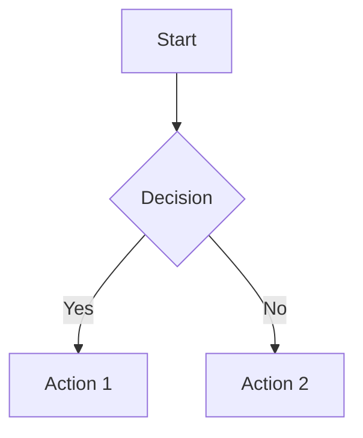

# Diagram Source Files

Mermaid diagram source files (`.mmd`) for generating PNG images.

## Quick Start

```bash
# Generate all diagrams
npm run diagrams

# Edit a diagram
vim docs/diagrams/architecture/layers.mmd

# Regenerate
npm run diagrams
```

## Structure

```
docs/
├── diagrams/           # Mermaid source files (.mmd)
│   ├── architecture/
│   ├── workflows/
│   ├── ingestor/
│   ├── repositories/
│   ├── decisions/
│   ├── dependencies/
│   └── agents/
└── images/             # Generated PNG files (auto-generated)
```

## Diagrams

| Diagram | Source | Output |
|---------|--------|--------|
| Layer Architecture | `architecture/layers.mmd` | `../images/architecture/layers.png` |
| Customer Chatbot | `workflows/customer_chatbot.mmd` | `../images/workflows/customer_chatbot.png` |
| Client Chatbot | `workflows/client_chatbot.mmd` | `../images/workflows/client_chatbot.png` |
| Ingestor Pipeline | `ingestor/pipeline.mmd` | `../images/ingestor/pipeline.png` |
| Dependency Graph | `dependencies/dependency_graph.mmd` | `../images/dependencies/dependency_graph.png` |
| ReAct Decision | `decisions/react_decision.mmd` | `../images/decisions/react_decision.png` |
| Memory Architecture | `decisions/memory_architecture.mmd` | `../images/decisions/memory_architecture.png` |
| Repository Layers | `repositories/layers.mmd` | `../images/repositories/layers.png` |
| Checkpointer | `repositories/checkpointer.mmd` | `../images/repositories/checkpointer.png` |
| Store | `repositories/store.mmd` | `../images/repositories/store.png` |
| Chatbot Repo | `repositories/chatbot.mmd` | `../images/repositories/chatbot.png` |
| ProductAgent | `agents/products.mmd` | `../images/agents/products.png` |

## Editing Diagrams

1. Edit the `.mmd` file using Mermaid syntax
2. Run `npm run diagrams` to regenerate PNGs
3. Commit both `.mmd` and `.png` files

## Mermaid Syntax



See [Mermaid Documentation](https://mermaid.js.org/syntax/flowchart.html) for full syntax.

## Theme Configuration

Edit `scripts/mermaid-config.json` to change colors and styling.

Current theme:
- Primary: Light blue (`#e8f4fd`)
- Border: Blue (`#3b82f6`)
- Text: Dark (`#1a1a1a`)
- Background: White
