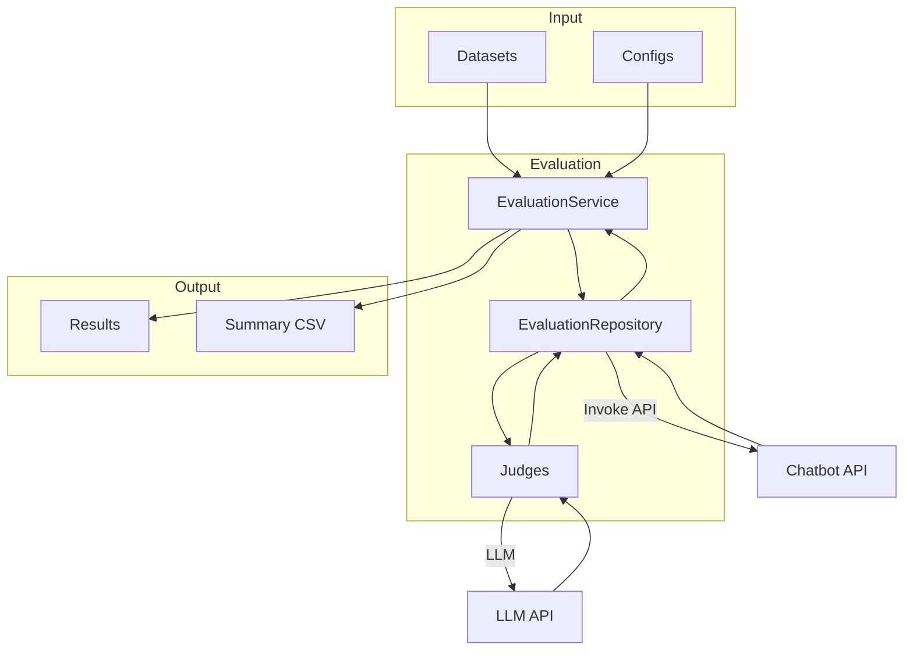

# Evaluation Framework

LLM-as-Judge evaluation framework for multi-agent chatbots.

## Overview

Evaluates chatbot responses using multiple judges that assess different aspects of the response.



## Quick Start

```bash
# Run customer chatbot evaluation
python scripts/run_eval.py customer

# Run client chatbot evaluation
python scripts/run_eval.py client
```

## Documentation

| Topic | Description | Link |
|-------|-------------|------|
| Architecture | System design and flow | [architecture.md](architecture.md) |
| Judges | Judge types and scoring | [judges/README.md](judges/README.md) |
| Datasets | Test case format and structure | [datasets.md](datasets.md) |
| Configs | Evaluation configuration | [configs.md](configs.md) |
| Results | Output format and interpretation | [results.md](results.md) |

## Judges

| Judge | Purpose | Used By |
|-------|---------|---------|
| SQL | SQL query correctness | Both |
| Search | Vector search quality | Customer |
| Visualization | Chart generation quality | Client |
| Response Quality | Response relevance and faithfulness | Both |

## Directory Structure

```
evaluation/
├── entities.py              # Data classes (TestCase, JudgeResult, etc.)
├── loader.py                # DatasetLoader
├── judges/
│   ├── base.py              # BaseJudge
│   ├── selector.py          # JudgeSelector
│   ├── sql/main.py          # SQLJudge
│   ├── search/main.py       # SearchJudge
│   ├── visualization/main.py # VisualizationJudge
│   └── response_quality/main.py # ResponseQualityJudge
├── repositories/
│   ├── base.py              # BaseEvaluationRepository
│   └── main.py              # EvaluationRepository
├── usecases/
│   └── main.py              # EvaluationService
└── dependencies/
    ├── customer.py          # Customer eval factory
    └── client.py            # Client eval factory
```

## Design Decisions

| Decision | Link |
|----------|------|
| LLM-as-Judge | [why_llm_as_judge.md](../decisions/why_llm_as_judge.md) |
