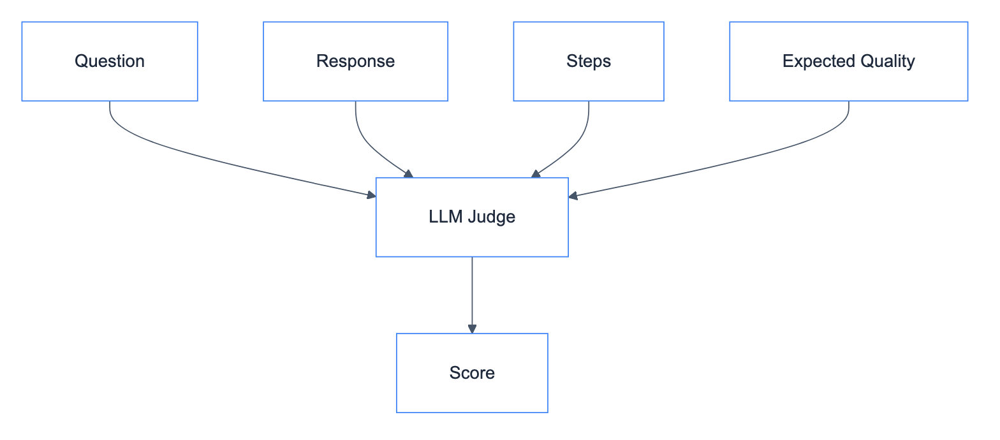

# **✨ Response Quality Judge**

Evaluates response relevance and faithfulness.


---


## **📋 Expected Field**

```yaml
expected_output:
  response_quality: "Should provide product details including price and availability"
```


---


## **📊 Scoring**

| Sub-score | Weight | Description |
|-----------|--------|-------------|
| Relevance | 50% | Does response address the question? |
| Faithfulness | 50% | Is response grounded in facts? |

**Pass threshold**: 0.7


---


## **🔄 Flow**

<details>
<summary>📊 Flow</summary>



</details>


---


## **❌ Negative Case**

```yaml
expected_output:
  response_quality: "null"
```

- Pass: No response generated
- Fail: Response was generated


---


## **📝 Context**

Judge receives chatbot context (permissions, restrictions) to evaluate if response is appropriate.


---


## **📄 Prompt**

[response_quality_judge.md](../../prompts/evaluation/judges/response_quality_judge.md)


---


## **🔗 References**

- [ResponseQualityJudge](../../../evaluation/judges/response_quality/main.py)
