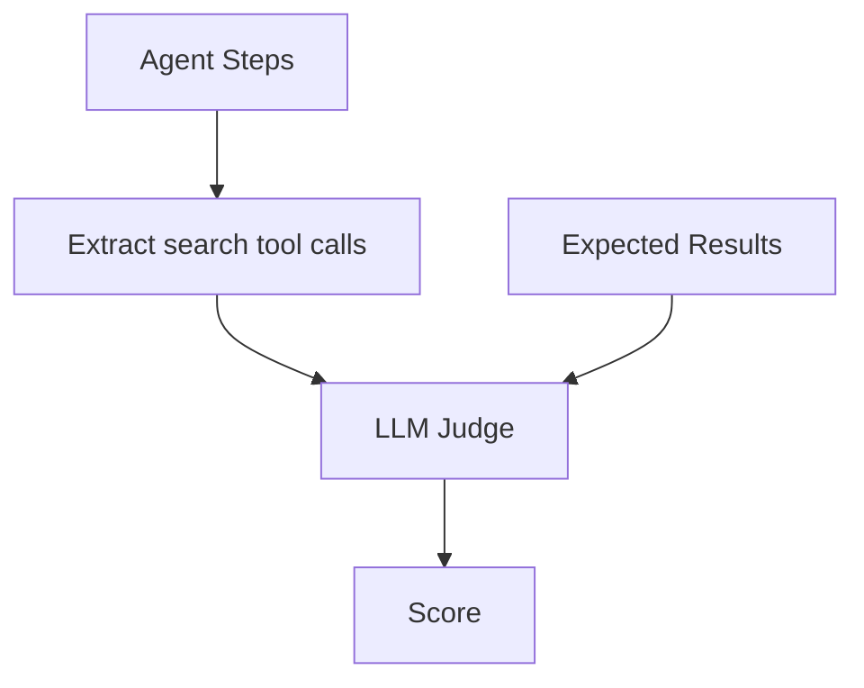

# Search Judge

Evaluates vector search quality.

## Expected Field

```yaml
expected_output:
  search_results: ["Wireless Bluetooth Headphones", "Noise Cancelling Headphones"]
```

## Scoring

| Sub-score | Weight | Description |
|-----------|--------|-------------|
| Relevance | 50% | Are results relevant to query? |
| Coverage | 50% | Are expected products found? |

**Pass threshold**: 0.6

## Flow



## Negative Cases

```yaml
# Should not search
expected_output:
  search_results: "null"

# Should return no results
expected_output:
  search_results: []
```

## Tool Names

Extracts from these tool calls:
- `product_search`
- `similar_products`

## Prompt

`evaluation_judges_search_judge`

## References

- [SearchJudge](../../../evaluation/judges/search/main.py)
