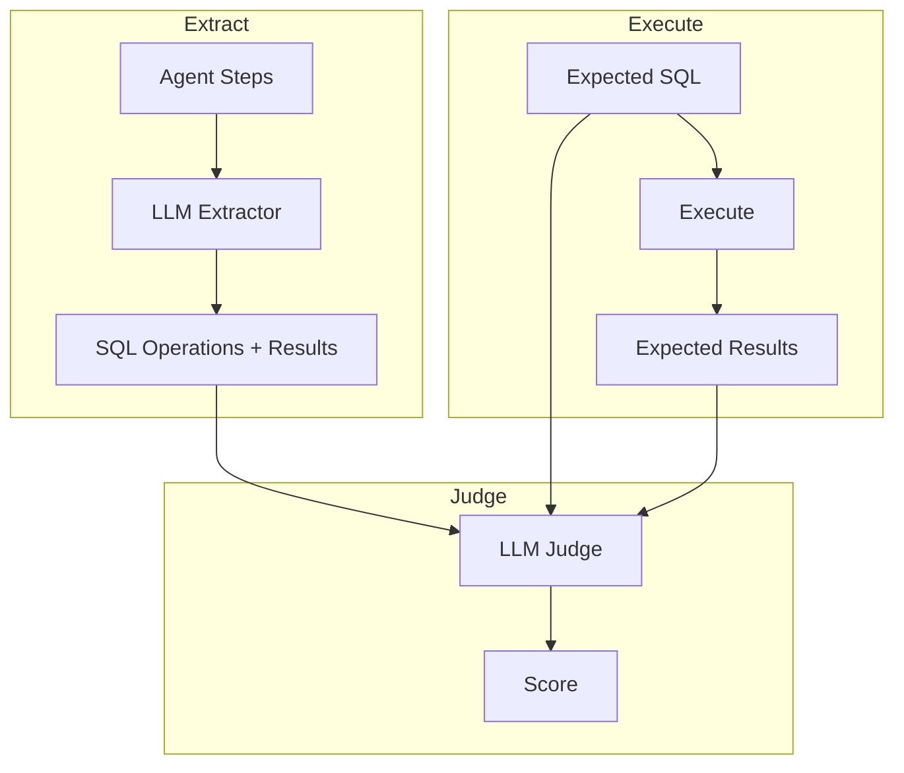

# SQL Judge

Evaluates SQL query correctness.

## Expected Field

```yaml
expected_output:
  sql: "SELECT * FROM products WHERE category = 'Electronics'"
```

## Scoring

| Sub-score | Weight | Description |
|-----------|--------|-------------|
| Result Match | 70% | Do agent results match expected results? |
| Efficiency | 30% | Is the SQL efficient? |

**Pass threshold**: 0.7

## Flow



## Negative Case

```yaml
expected_output:
  sql: "null"
```

- Pass: No SQL operations found
- Fail: SQL was generated

## Prompt

- [sql_judge.md](../../prompts/evaluation/judges/sql_judge.md) - Judge SQL correctness
- [sql_extractor.md](../../prompts/evaluation/extractors/sql_extractor.md) - Extract SQL from steps

## References

- [SQLJudge](../../../evaluation/judges/sql/main.py)
- [Decision: LLM-as-Judge](../../decisions/why_llm_as_judge.md)
