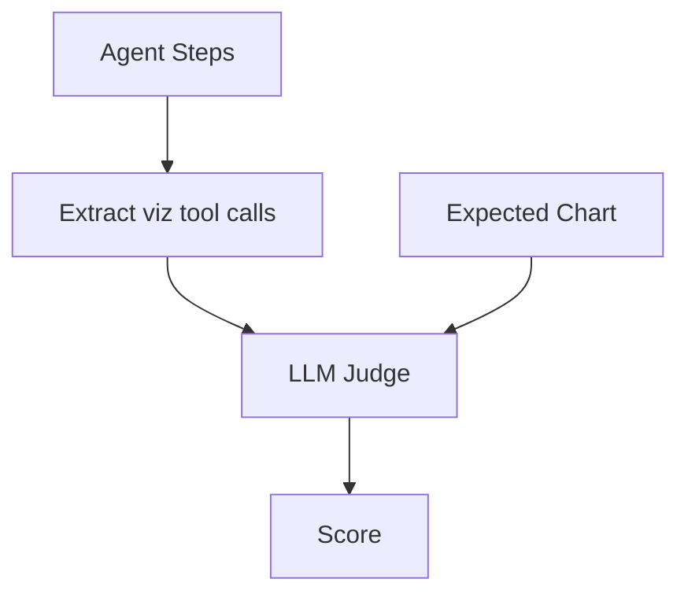

# Visualization Judge

Evaluates chart generation quality.

## Expected Fields

```yaml
expected_output:
  has_chart: true
  chart_type: "bar"
```

## Scoring

| Sub-score | Weight | Description |
|-----------|--------|-------------|
| Appropriateness | 50% | Is chart appropriate for query? |
| Chart Type | 50% | Is chart type correct? |

**Pass threshold**: 0.7

## Flow



## Negative Case

```yaml
expected_output:
  has_chart: false
```

- Pass: No visualization created
- Fail: Chart was generated

## Tool Names

Extracts from these tool calls:
- `create_visualization`
- `create_chart`

## Prompt

`evaluation_judges_visualization_judge`

## References

- [VisualizationJudge](../../../evaluation/judges/visualization/main.py)
