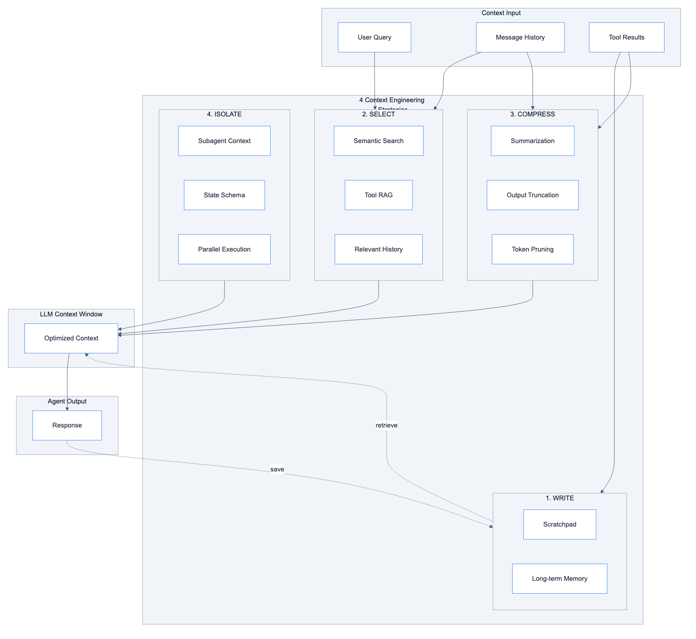

# Context Engineering

Techniques for managing LLM context windows effectively in the MTL Agent system.



## What is Context Engineering?

Context engineering is the art of filling the context window with **just the right information** at each step of an agent's trajectory. Think of it like RAM management for LLMs.

> "Context engineering is becoming the most important skill an AI engineer can develop."
> — [LangChain Blog](https://blog.langchain.com/context-engineering-for-agents/)

## The 4 Strategies

| Strategy | Action | Goal |
|----------|--------|------|
| **Write** | Save context outside window | Persist for later use |
| **Select** | Pull relevant context in | Only what's needed |
| **Compress** | Reduce token count | Fit more in window |
| **Isolate** | Split across agents | Focused context per task |

---

## 1. Write Context

**Purpose**: Save information outside the context window for later retrieval.

### Current Problem

```python
# InsightAgent accumulates everything in messages
state["messages"].append(AIMessage(content=f"""
SQL Query: {sql}
Results: {large_result}  # Could be 1000+ rows!
"""))
# Context grows with each tool call
```

### Solution: Scratchpad

```python
# src/modules/tools/context/scratchpad.py
from langchain_core.tools import BaseTool
from langgraph.store.base import BaseStore

class WriteToScratchpad(BaseTool):
    name: str = "write_scratch"
    description: str = """
    Save data outside context window for later retrieval.
    Use for: large SQL results, intermediate calculations, notes.

    Args:
        key: Identifier for the data (e.g., "top_customers")
        value: Data to save (will be JSON serialized)
        summary: Brief description for context (shown to LLM)
    """
    store: BaseStore

    def _run(self, key: str, value: Any, summary: str = None) -> str:
        namespace = ("scratch", self.thread_id)
        self.store.put(namespace, key, {
            "data": value,
            "summary": summary or f"Saved {len(str(value))} chars",
            "timestamp": datetime.now().isoformat()
        })
        return f"Saved to scratch:{key} - {summary}"


class ReadFromScratchpad(BaseTool):
    name: str = "read_scratch"
    description: str = """
    Retrieve previously saved data from scratchpad.

    Args:
        key: Identifier used when saving
    """
    store: BaseStore

    def _run(self, key: str) -> Any:
        namespace = ("scratch", self.thread_id)
        item = self.store.get(namespace, key)
        if item:
            return item.value["data"]
        return f"No data found for key: {key}"
```

### Usage Pattern

```python
# Before: Everything in messages (bad)
Agent: "Found 500 orders totaling $50,000..."
       [500 rows of data in message]

# After: Write to scratchpad (good)
Agent: write_scratch(
    key="customer_orders",
    value=orders_dataframe,
    summary="500 orders, $50K total, top customer: ABC Corp"
)
# Only summary in context, full data retrievable
```

### Long-term Memory

For cross-session persistence:

```python
# src/modules/memory/long_term.py
class LongTermMemory:
    """Persist learnings across conversations."""

    def __init__(self, store: BaseStore):
        self.store = store

    def remember(self, user_id: str, fact: str, category: str):
        """Save a fact about the user."""
        namespace = ("memory", user_id, category)
        key = f"fact_{datetime.now().timestamp()}"
        self.store.put(namespace, key, {
            "fact": fact,
            "created": datetime.now().isoformat()
        })

    def recall(self, user_id: str, category: str = None) -> list[str]:
        """Retrieve facts about the user."""
        if category:
            namespace = ("memory", user_id, category)
        else:
            namespace = ("memory", user_id)

        items = self.store.search(namespace)
        return [item.value["fact"] for item in items]
```

---

## 2. Select Context

**Purpose**: Pull only relevant information into the context window.

### Current Problem

```python
# All history loaded, even irrelevant turns
history = self.checkpointer.get_messages(thread_id)  # Could be 100+ messages
state = {"messages": history, "query": query}
# Agent sees everything, gets distracted
```

### Solution: Semantic Selection

```python
# src/modules/context/selector.py
from langchain_core.embeddings import Embeddings
from langchain_core.messages import BaseMessage

class ContextSelector:
    """Select relevant context using embeddings."""

    def __init__(self, embeddings: Embeddings):
        self.embeddings = embeddings

    def select_relevant_messages(
        self,
        query: str,
        messages: list[BaseMessage],
        top_k: int = 10,
        always_keep_recent: int = 3
    ) -> list[BaseMessage]:
        """Select most relevant messages for the query."""

        if len(messages) <= top_k:
            return messages

        # Always keep recent messages
        recent = messages[-always_keep_recent:]
        candidates = messages[:-always_keep_recent]

        if not candidates:
            return recent

        # Embed query and messages
        query_embedding = self.embeddings.embed_query(query)
        message_texts = [m.content for m in candidates]
        message_embeddings = self.embeddings.embed_documents(message_texts)

        # Calculate similarities
        similarities = [
            self._cosine_similarity(query_embedding, msg_emb)
            for msg_emb in message_embeddings
        ]

        # Select top-k most relevant
        top_indices = sorted(
            range(len(similarities)),
            key=lambda i: similarities[i],
            reverse=True
        )[:top_k - always_keep_recent]

        # Maintain chronological order
        top_indices = sorted(top_indices)
        selected = [candidates[i] for i in top_indices]

        return selected + recent

    def _cosine_similarity(self, a: list[float], b: list[float]) -> float:
        dot = sum(x * y for x, y in zip(a, b))
        norm_a = sum(x ** 2 for x in a) ** 0.5
        norm_b = sum(x ** 2 for x in b) ** 0.5
        return dot / (norm_a * norm_b)
```

### Tool Selection with RAG

When you have many tools, use RAG to select relevant ones:

```python
# src/modules/context/tool_selector.py
class ToolSelector:
    """Select relevant tools using embeddings."""

    def __init__(self, tools: list[BaseTool], embeddings: Embeddings):
        self.tools = tools
        self.embeddings = embeddings
        self._build_index()

    def _build_index(self):
        """Build embedding index for tool descriptions."""
        descriptions = [
            f"{tool.name}: {tool.description}"
            for tool in self.tools
        ]
        self.tool_embeddings = self.embeddings.embed_documents(descriptions)

    def select_tools(self, query: str, top_k: int = 5) -> list[BaseTool]:
        """Select most relevant tools for the query."""
        query_embedding = self.embeddings.embed_query(query)

        similarities = [
            (i, self._cosine_similarity(query_embedding, tool_emb))
            for i, tool_emb in enumerate(self.tool_embeddings)
        ]

        top_indices = sorted(similarities, key=lambda x: x[1], reverse=True)[:top_k]
        return [self.tools[i] for i, _ in top_indices]
```

### Usage in Repository

```python
# src/repositories/chatbots/client/main.py
class ClientChatbotRepository:
    def __init__(self, ..., context_selector: ContextSelector):
        self.context_selector = context_selector

    def invoke(self, query: str, thread_id: str, ...):
        # Get full history
        full_history = self.checkpointer.get_messages(thread_id)

        # Select only relevant messages
        relevant_history = self.context_selector.select_relevant_messages(
            query=query,
            messages=full_history,
            top_k=10,
            always_keep_recent=3
        )

        # Build state with selected context
        state = {
            "messages": relevant_history,
            "query": query,
            ...
        }
```

---

## 3. Compress Context

**Purpose**: Retain only essential tokens to reduce cost and latency.

### Current Problem

```python
# Messages grow unbounded
state["messages"]  # 100+ turns = 50K+ tokens
# Eventually exceeds context window or degrades performance
```

### Solution: Auto-Summarization

```python
# src/modules/context/compressor.py
from langchain_core.language_models import BaseChatModel
from langchain_core.messages import BaseMessage, SystemMessage, HumanMessage

class ContextCompressor:
    """Compress context when it exceeds threshold."""

    SUMMARY_PROMPT = """Summarize this conversation concisely.
Preserve:
- Key decisions made
- Important data/numbers mentioned
- Current task status
- User preferences learned

Conversation:
{conversation}

Summary:"""

    def __init__(
        self,
        llm: BaseChatModel,
        max_tokens: int = 4000,
        compress_threshold: float = 0.8
    ):
        self.llm = llm
        self.max_tokens = max_tokens
        self.compress_threshold = compress_threshold

    def maybe_compress(
        self,
        messages: list[BaseMessage],
        keep_recent: int = 5
    ) -> list[BaseMessage]:
        """Compress messages if exceeding threshold."""

        estimated_tokens = self._estimate_tokens(messages)
        threshold = self.max_tokens * self.compress_threshold

        if estimated_tokens < threshold:
            return messages  # No compression needed

        # Keep recent messages verbatim
        recent = messages[-keep_recent:]
        to_compress = messages[:-keep_recent]

        if not to_compress:
            return messages

        # Summarize older messages
        summary = self._summarize(to_compress)

        # Return summary + recent
        return [
            SystemMessage(content=f"[Previous conversation summary]\n{summary}"),
            *recent
        ]

    def _summarize(self, messages: list[BaseMessage]) -> str:
        """Summarize a list of messages."""
        conversation = "\n".join([
            f"{msg.type}: {msg.content[:500]}"  # Truncate long messages
            for msg in messages
        ])

        response = self.llm.invoke([
            HumanMessage(content=self.SUMMARY_PROMPT.format(
                conversation=conversation
            ))
        ])

        return response.content

    def _estimate_tokens(self, messages: list[BaseMessage]) -> int:
        """Rough token estimation (4 chars ≈ 1 token)."""
        total_chars = sum(len(m.content) for m in messages)
        return total_chars // 4
```

### Tool Output Compression

```python
# src/modules/context/output_compressor.py
class ToolOutputCompressor:
    """Compress large tool outputs."""

    MAX_ROWS_DISPLAY = 10
    MAX_CHARS = 2000

    def compress_sql_result(self, result: list[dict]) -> str:
        """Compress SQL results for context."""

        if not result:
            return "No results found."

        total_rows = len(result)

        if total_rows <= self.MAX_ROWS_DISPLAY:
            return self._format_rows(result)

        # Show sample + summary
        sample = result[:self.MAX_ROWS_DISPLAY]

        # Calculate aggregates if numeric columns exist
        summary = self._calculate_summary(result)

        return f"""Found {total_rows} rows.

Sample (first {self.MAX_ROWS_DISPLAY}):
{self._format_rows(sample)}

Summary:
{summary}

[Full data saved to scratchpad - use read_scratch to access]"""

    def _format_rows(self, rows: list[dict]) -> str:
        """Format rows as readable table."""
        if not rows:
            return ""

        headers = list(rows[0].keys())
        lines = [" | ".join(headers)]
        lines.append("-" * len(lines[0]))

        for row in rows:
            lines.append(" | ".join(str(row.get(h, "")) for h in headers))

        return "\n".join(lines)

    def _calculate_summary(self, rows: list[dict]) -> str:
        """Calculate summary statistics."""
        if not rows:
            return ""

        summaries = []
        for key in rows[0].keys():
            values = [r.get(key) for r in rows if r.get(key) is not None]

            # Check if numeric
            if values and isinstance(values[0], (int, float)):
                summaries.append(
                    f"  {key}: min={min(values)}, max={max(values)}, "
                    f"avg={sum(values)/len(values):.2f}"
                )

        return "\n".join(summaries) if summaries else "No numeric columns"
```

### Integration in Workflow

```python
# src/modules/workflows/client_chatbot/main.py
class ClientChatbotWorkflow(BaseWorkflow):
    def __init__(self, ..., compressor: ContextCompressor):
        self.compressor = compressor

    def _pre_agent(self, state: ClientChatbotState) -> dict:
        """Compress context before agent execution."""

        compressed_messages = self.compressor.maybe_compress(
            messages=state["messages"],
            keep_recent=5
        )

        return {"messages": compressed_messages}
```

---

## 4. Isolate Context

**Purpose**: Split context across agents to maintain focus.

### Current Implementation (Good!)

Your system already uses isolation via the Orchestrator:

```python
# Current: Orchestrator routes to isolated agents
OrchestratorAgent
    ├── ChatHistoryAgent  # Only sees chat history tools
    └── InsightAgent      # Only sees analytics tools
```

### Enhancement: State Schema Isolation

Control what each agent sees:

```python
# src/modules/workflows/client_chatbot/state.py
from typing import TypedDict, Annotated

class ClientChatbotState(TypedDict):
    # Shared (all agents see)
    query: str
    customer_id: str

    # Isolated per agent
    orchestrator_context: dict      # Only orchestrator writes
    chat_history_context: dict      # Only chat_history agent writes
    insight_context: dict           # Only insight agent writes

    # Output
    response: str
    steps: list[dict]
```

```python
# src/modules/agents/client/insight.py
class InsightAgent(BaseAgent):
    def execute(self, state: dict) -> dict:
        # Only sees what it needs
        agent_state = {
            "query": state["query"],
            "customer_id": state["customer_id"],
            # Does NOT see chat_history_context
        }

        result = self.agent.invoke(agent_state)

        # Writes only to its own context
        return {
            "insight_context": {
                "sql_executed": result.get("sql"),
                "rows_returned": len(result.get("results", [])),
            },
            "response": result["response"],
            "steps": result["steps"],
        }
```

### Multi-Agent Parallel Execution

```python
# src/modules/workflows/parallel_agents.py
from langgraph.graph import StateGraph, END
import asyncio

class ParallelAgentWorkflow:
    """Run multiple agents in parallel with isolated context."""

    def build(self) -> StateGraph:
        graph = StateGraph(ParallelState)

        # Fan-out to parallel agents
        graph.add_node("analyzer", self._run_analyzer)
        graph.add_node("researcher", self._run_researcher)
        graph.add_node("summarizer", self._run_summarizer)

        # All start from entry
        graph.add_edge("__start__", "analyzer")
        graph.add_edge("__start__", "researcher")
        graph.add_edge("__start__", "summarizer")

        # All converge to combiner
        graph.add_node("combiner", self._combine_results)
        graph.add_edge("analyzer", "combiner")
        graph.add_edge("researcher", "combiner")
        graph.add_edge("summarizer", "combiner")

        graph.add_edge("combiner", END)

        return graph

    async def _run_analyzer(self, state: dict) -> dict:
        # Isolated context - only sees query
        result = await self.analyzer.ainvoke({
            "query": state["query"]
        })
        return {"analyzer_result": result}

    async def _run_researcher(self, state: dict) -> dict:
        # Isolated context - only sees query
        result = await self.researcher.ainvoke({
            "query": state["query"]
        })
        return {"researcher_result": result}
```

---

## Context Pathologies to Avoid

| Pathology | Description | Prevention |
|-----------|-------------|------------|
| **Poisoning** | Hallucinations stored in context | Validate tool outputs before saving |
| **Distraction** | Irrelevant info overwhelms agent | Use semantic selection |
| **Confusion** | Conflicting information | Timestamp and version context |
| **Clash** | Context contradicts system prompt | Review prompts for conflicts |

### Detection and Prevention

```python
# src/modules/context/validator.py
class ContextValidator:
    """Detect and prevent context pathologies."""

    def validate_tool_output(self, output: Any) -> tuple[bool, str]:
        """Check for potential poisoning."""

        if isinstance(output, str):
            # Check for obvious hallucination patterns
            hallucination_patterns = [
                r"I don't have access to",
                r"I cannot",
                r"As an AI",
                r"I'm not sure but",
            ]

            for pattern in hallucination_patterns:
                if re.search(pattern, output, re.IGNORECASE):
                    return False, f"Potential hallucination detected: {pattern}"

        return True, "OK"

    def check_contradiction(
        self,
        new_fact: str,
        existing_context: list[str]
    ) -> tuple[bool, str]:
        """Check if new fact contradicts existing context."""
        # Use LLM to check for contradictions
        # Return (has_contradiction, explanation)
        pass
```

---

## Implementation Phases

### Phase 1: Compression (1 week)
**Files to create/modify:**
- `src/modules/context/compressor.py` - ContextCompressor class
- `src/modules/context/output_compressor.py` - ToolOutputCompressor
- `src/modules/workflows/*/main.py` - Add compression hooks

**Impact**: Immediate reduction in token usage

### Phase 2: Scratchpad (1 week)
**Files to create/modify:**
- `src/modules/tools/context/scratchpad.py` - Write/Read tools
- `src/modules/agents/*/main.py` - Add scratchpad tools
- Agent prompts - Instruct to use scratchpad

**Impact**: Large results no longer bloat context

### Phase 3: Selection (2 weeks)
**Files to create/modify:**
- `src/modules/context/selector.py` - ContextSelector class
- `src/repositories/chatbots/*/main.py` - Integrate selector
- Embedding service integration

**Impact**: Only relevant history in context

### Phase 4: Enhanced Isolation (1 week)
**Files to create/modify:**
- `src/modules/workflows/*/state.py` - Isolated state fields
- `src/modules/agents/*/main.py` - Use isolated context
- Consider parallel execution

**Impact**: Cleaner, focused agent context

---

## Metrics to Track

| Metric | How to Measure | Goal |
|--------|----------------|------|
| Avg tokens per turn | LangSmith trace | < 2000 |
| Context compression ratio | Before/after token count | > 50% reduction |
| Selection relevance | User feedback, task success | > 90% relevant |
| Agent response quality | LLM-as-judge evaluation | No degradation |

---

## References

- [Context Engineering Blog](https://blog.langchain.com/context-engineering-for-agents/)
- [The Rise of Context Engineering](https://blog.langchain.com/the-rise-of-context-engineering/)
- [Context Engineering GitHub](https://github.com/langchain-ai/context_engineering)
- [Filesystems for Context Engineering](https://blog.langchain.com/how-agents-can-use-filesystems-for-context-engineering/)
- [State of AI Agents 2025](https://www.langchain.com/state-of-agent-engineering)
