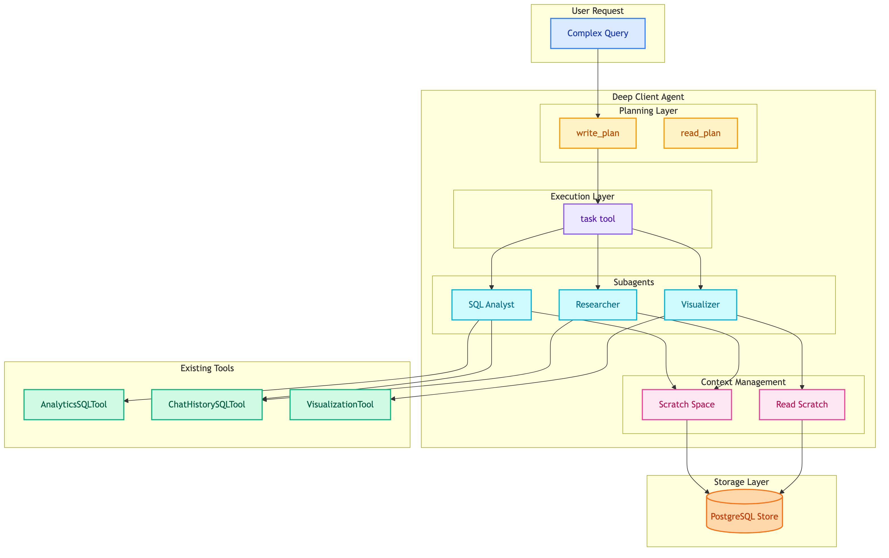

# **🤖 Deep Agents Integration Plan**

Integrating [LangChain Deep Agents](https://github.com/langchain-ai/deepagents) patterns into the MTL Agent system.




---


## **❓ Why Deep Agents?**

Current system uses simple ReAct agents that struggle with:
- Multi-step analytics queries
- Context accumulation over long conversations
- Dynamic task delegation

Deep Agents solve these with: **Planning**, **Subagents**, and **Scratch Space**.


---


## **🏗️ Current vs. Deep Agents Architecture**

```
Current Architecture:
┌─────────────────────────────────────────────┐
│ Workflow (Fixed Graph)                      │
│  translate → orchestrator → agent → output  │
│                    ↓                        │
│              [fixed routing]                │
│            ↙            ↘                   │
│     ChatHistory      Insight                │
└─────────────────────────────────────────────┘

Deep Agents Architecture:
┌─────────────────────────────────────────────┐
│ Deep Agent (Dynamic)                        │
│  ┌─────────────────────────────────────┐    │
│  │ Planning: write_todos / read_todos  │    │
│  └─────────────────────────────────────┘    │
│                    ↓                        │
│  ┌─────────────────────────────────────┐    │
│  │ Execute: spawn subagents as needed  │    │
│  │  → SQLSubagent                      │    │
│  │  → VectorSearchSubagent             │    │
│  │  → VisualizationSubagent            │    │
│  └─────────────────────────────────────┘    │
│                    ↓                        │
│  ┌─────────────────────────────────────┐    │
│  │ Scratch Space: store intermediate   │    │
│  │ results, notes, context             │    │
│  └─────────────────────────────────────┘    │
└─────────────────────────────────────────────┘
```

## Integration Components

### 1. Planning Tool (Todo List)

Add explicit planning for complex queries.

**New Tool**: `PlanningTool`

```python
# src/modules/tools/planning/main.py
from langchain_core.tools import BaseTool

class PlanningTool(BaseTool):
    name: str = "write_plan"
    description: str = """
    Break down complex tasks into steps.
    Use when query requires multiple operations.

    Example:
    Input: "Top customers with order trends"
    Output: [
        "1. Query orders grouped by customer",
        "2. Sort by total amount",
        "3. Get historical data for top 5",
        "4. Generate trend chart"
    ]
    """

    def _run(self, steps: list[str]) -> dict:
        return {"plan": steps, "current_step": 0}
```

**When to Use**:
- Query contains multiple entities (customers AND orders AND trends)
- Query requires aggregation + visualization
- Query spans multiple time periods

### 2️⃣ **Subagent Spawning**

Replace fixed orchestrator routing with dynamic subagent delegation.

**Current** (fixed):
```python
# Orchestrator returns Intent enum
if intent == Intent.CHAT_HISTORY:
    run_chat_history_agent()
else:
    run_insight_agent()
```

**Deep Agents** (dynamic):
```python
# src/modules/agents/deep/main.py
from deepagents import create_deep_agent

class DeepClientAgent:
    def __init__(self, tools: list, subagents: list):
        self.agent = create_deep_agent(
            tools=tools,
            subagents=[
                {
                    "name": "sql-analyst",
                    "description": "Execute SQL queries for analytics",
                    "tools": [AnalyticsSQLTool(), ChatHistorySQLTool()],
                },
                {
                    "name": "visualizer",
                    "description": "Create charts and graphs",
                    "tools": [VisualizationTool()],
                },
                {
                    "name": "researcher",
                    "description": "Search and analyze chat history",
                    "tools": [ChatHistorySQLTool()],
                },
            ],
            system_prompt=DEEP_CLIENT_PROMPT,
        )
```

**Benefit**: Agent decides which subagent to spawn based on task, not fixed routing.

### 3️⃣ **Scratch Space (Context Management)**

Store intermediate results instead of accumulating in message history.

**Problem**: Long analytics queries accumulate large SQL results in messages.

**Solution**: Write to scratch space, reference later.

```python
# src/modules/tools/scratch/main.py
class ScratchSpaceTool(BaseTool):
    name: str = "save_to_scratch"
    description: str = "Save intermediate results for later reference"

    def __init__(self, store: BaseStore):
        self.store = store  # Use existing PostgreSQL store

    def _run(self, key: str, value: Any) -> str:
        self.store.put(
            namespace=("scratch", thread_id),
            key=key,
            value={"data": value, "timestamp": datetime.now()}
        )
        return f"Saved to scratch:{key}"

class ReadScratchTool(BaseTool):
    name: str = "read_scratch"
    description: str = "Read previously saved results"

    def _run(self, key: str) -> Any:
        return self.store.get(namespace=("scratch", thread_id), key=key)
```

**Example Flow**:
```
User: "Compare Q3 vs Q4 sales by category with charts"

Agent Plan:
1. Query Q3 sales → save_to_scratch("q3_sales")
2. Query Q4 sales → save_to_scratch("q4_sales")
3. Read both → read_scratch("q3_sales"), read_scratch("q4_sales")
4. Generate comparison chart
```

### 4️⃣ **Enhanced System Prompts**

Deep Agents use detailed prompts with explicit instructions.

**Current** (minimal):
```python
system_prompt = """You are an analytics assistant.
Current time: {current_datetime}
"""
```

**Deep Agents** (detailed):
```python
DEEP_CLIENT_PROMPT = """
You are an expert business intelligence analyst for an ERP system.

## Your Capabilities
- SQL analytics on customer, order, and chat data
- Data visualization with Plotly charts
- Chat history lookup and analysis

## Planning Strategy
For complex queries:
1. Use write_plan to break down into steps
2. Execute each step, saving intermediate results
3. Combine results for final answer

## When to Spawn Subagents
- "sql-analyst": Data queries, aggregations, joins
- "visualizer": Charts, graphs, dashboards
- "researcher": Chat history, conversation analysis

## Context Management
- Save large query results to scratch space
- Reference saved data instead of re-querying
- Summarize before responding

## Response Format
- Always explain your reasoning
- Show data tables when relevant
- Include visualizations for trends

Current time: {current_datetime}
Timezone: {timezone}
"""
```


---


## **📅 Implementation Phases**


### 1️⃣ **Phase 1: Add Planning Tool (1 week)**
- Create `PlanningTool` with todo list functionality
- Integrate into existing InsightAgent
- Test with multi-step queries

### 2️⃣ **Phase 2: Add Scratch Space (1 week)**
- Create `ScratchSpaceTool` using existing Store
- Modify agents to save/read intermediate results
- Reduce message history accumulation

### 3️⃣ **Phase 3: Migrate to Deep Agents (2 weeks)**
- Install `deepagents` library
- Create `DeepClientAgent` with subagents
- Migrate InsightAgent logic to subagent
- Update workflow to use deep agent

### 4️⃣ **Phase 4: Enhanced Prompts (1 week)**
- Rewrite system prompts with detailed instructions
- Add few-shot examples
- Test and iterate


---


## **📁 File Structure After Integration**

```
src/modules/
├── agents/
│   ├── deep/                    # NEW
│   │   ├── __init__.py
│   │   ├── main.py              # DeepClientAgent
│   │   └── prompts.py           # Detailed prompts
│   └── subagents/               # NEW
│       ├── sql_analyst.py
│       ├── visualizer.py
│       └── researcher.py
├── tools/
│   ├── planning/                # NEW
│   │   └── main.py              # PlanningTool
│   └── scratch/                 # NEW
│       └── main.py              # ScratchSpaceTool
└── workflows/
    └── client_chatbot/
        └── main.py              # Updated to use DeepClientAgent
```


---


## **💡 Example: Before vs After**

**Query**: "Show me top 5 customers by revenue in Q4, their order history, and a trend chart"

### ❌ **Before (Current System)**

```
1. Orchestrator → routes to InsightAgent
2. InsightAgent:
   - Calls AnalyticsSQLTool (full result in messages)
   - Calls VisualizationTool
   - Context grows with each step
3. Single response with chart
```

**Issues**: No planning visible, context bloat, no intermediate saves

### ✅ **After (Deep Agents)**

```
1. DeepClientAgent receives query
2. Planning:
   write_plan([
     "Query Q4 revenue by customer",
     "Get top 5 customers",
     "Query order history for each",
     "Generate trend visualization"
   ])
3. Execution:
   - spawn("sql-analyst") → query revenue
   - save_to_scratch("top_customers", results)
   - spawn("sql-analyst") → query order history
   - save_to_scratch("order_history", results)
   - spawn("visualizer") → read scratch, create chart
4. Combine and respond
```

**Benefits**: Visible planning, context managed, parallel subagents possible


---


## **📦 Dependencies**

```toml
# pyproject.toml
[project.dependencies]
deepagents = "^0.1.0"
langgraph = "^0.2.0"  # Already using
```


---


## **🔗 References**

- [Deep Agents GitHub](https://github.com/langchain-ai/deepagents)
- [LangChain Blog: Deep Agents](https://blog.langchain.com/deep-agents/)
- [Deep Agents Overview](https://docs.langchain.com/oss/python/deepagents/overview)
