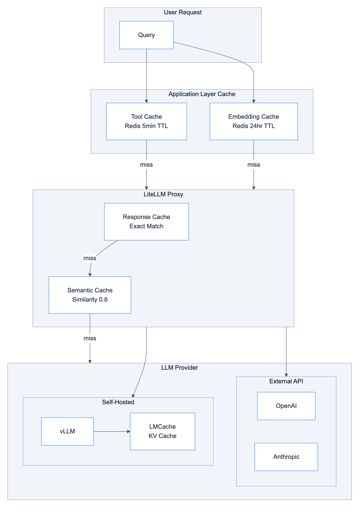

# **⚡ Caching Strategy**

Multi-layer caching architecture for LLM applications.

<details>
<summary>📊 Caching Layers</summary>



</details>

---


## **🆚 Caching vs Memory**

| Concept | Purpose | Example |
|---------|---------|---------|
| **Caching** | Avoid recomputation, reduce latency/cost | LLM response cache |
| **Memory** | Maintain state across turns | Checkpointer (Redis) |

This document covers **caching only**. For memory, see [Why Checkpointer and Store](../../decisions/why_checkpointer_and_store.md).

---

## **📊 Caching Layers Overview**

| Layer | Technology | What's Cached | Benefit |
|-------|------------|---------------|---------|
| **LLM Response** | LiteLLM + Redis | API responses | Avoid duplicate LLM calls |
| **Semantic Cache** | Redis + Embeddings | Similar prompts | Cache "close enough" queries |
| **KV Cache** | LMCache (vLLM) | Model computation | Faster inference (self-hosted) |
| **Embedding Cache** | Redis | Vector embeddings | Avoid re-embedding same text |
| **Tool Result Cache** | Redis | Expensive tool outputs | Faster repeated queries |

---

## **1️⃣ LiteLLM Response Caching**

Cache exact LLM responses to avoid duplicate API calls.

### Configuration

```yaml
# configs/litellm/proxy_config.yaml
litellm_settings:
  cache: True
  cache_params:
    type: "redis"
    host: "${REDIS_HOST}"
    port: ${REDIS_PORT}
    password: "${REDIS_PASSWORD}"
    ttl: 3600  # 1 hour
    namespace: "litellm.cache"
```

### 📋 **Cache Types**

| Type | Config | Use Case |
|------|--------|----------|
| `local` | In-memory | Development, single process |
| `redis` | Distributed | Production, multi-server |
| `redis-semantic` | Similarity-based | Similar prompts |
| `s3` | S3 bucket | Persistent cloud cache |
| `disk` | Local disk | Large responses, offline |

---

## **2️⃣ Semantic Caching**

Cache responses for semantically similar queries using embeddings.

### 🔄 **How It Works**

```
1. User query → Generate embedding
2. Search cache for similar embeddings (cosine similarity)
3. If similarity > threshold → Return cached response
4. Else → Call LLM → Cache response with embedding
```

### ⚙️ **Configuration**

```yaml
# configs/litellm/proxy_config.yaml
litellm_settings:
  cache: True
  cache_params:
    type: "redis-semantic"
    host: "${REDIS_HOST}"
    port: ${REDIS_PORT}
    password: "${REDIS_PASSWORD}"
    similarity_threshold: 0.8  # 0-1, higher = stricter
    ttl: 3600
    embedding_model: "text-embedding-3-small"
```

### 📊 **Similarity Threshold Guide**

| Threshold | Behavior | Use Case |
|-----------|----------|----------|
| 0.95+ | Almost exact match | Factual queries |
| 0.85-0.95 | Very similar | General Q&A |
| 0.75-0.85 | Somewhat similar | Conversational |
| < 0.75 | Not recommended | Too many false positives |

### ✅ **When to Use**

✅ **Good for**: FAQ, product lookups, repeated questions

❌ **Not good for**: Personalized responses, time-sensitive queries, analytics

---

## **3️⃣ LMCache (KV Cache for vLLM)**

For self-hosted LLM with vLLM, LMCache caches model computation (KV cache).

### 🆚 **LMCache vs LiteLLM Caching**

| Feature | LMCache | LiteLLM Caching |
|---------|---------|-----------------|
| **Cache level** | KV cache (model computation) | API response |
| **What's cached** | Internal key-value pairs after prefill | Complete API responses |
| **Purpose** | Reduce GPU computation, lower TTFT | Avoid duplicate API calls |
| **Storage** | GPU, CPU DRAM, Local Disk | In-memory, Redis, S3, GCS |
| **Performance** | 3-15x throughput improvement | Reduced API costs |
| **Use case** | Self-hosted inference optimization | API gateway for external providers |

### ✅ **When to Use Each**

- **LMCache**: Self-hosted vLLM deployment - caches at inference engine level
- **LiteLLM Cache**: API proxy - caches responses from external LLM providers

### ✨ **LMCache Benefits**

- Reuses KV caches across GPU, CPU DRAM, and disk
- 3-10x latency reduction for multi-round QA and RAG
- Up to 15x throughput improvement
- CacheBlend: compose multiple KV caches together

### ⚙️ **Configuration**

```yaml
# vLLM with LMCache
vllm_args:
  - --enable-lmcache
  - --lmcache-config-file=/config/lmcache.yaml
```

```yaml
# lmcache.yaml
chunk_size: 256
local_device: "cuda"
remote_url: "redis://redis:6379"
remote_serde: "cachegen"
```

---

## **4️⃣ Embedding Cache**

Cache embeddings to avoid re-embedding the same text.

### 💻 **Implementation**

```python
# src/libs/cache/embedding_cache.py
import hashlib
import json
from redis import Redis
from langchain_core.embeddings import Embeddings

class CachedEmbeddings(Embeddings):
    """Wrapper that caches embeddings in Redis."""

    def __init__(
        self,
        embeddings: Embeddings,
        redis: Redis,
        ttl: int = 86400,  # 24 hours
        prefix: str = "emb:"
    ):
        self.embeddings = embeddings
        self.redis = redis
        self.ttl = ttl
        self.prefix = prefix

    def _cache_key(self, text: str) -> str:
        hash_val = hashlib.sha256(text.encode()).hexdigest()[:16]
        return f"{self.prefix}{hash_val}"

    def embed_query(self, text: str) -> list[float]:
        key = self._cache_key(text)
        cached = self.redis.get(key)
        if cached:
            return json.loads(cached)

        embedding = self.embeddings.embed_query(text)
        self.redis.setex(key, self.ttl, json.dumps(embedding))
        return embedding
```

---

## **5️⃣ Tool Result Caching**

Cache expensive tool results (SQL queries, vector searches).

### 💻 **Implementation**

```python
# src/libs/cache/tool_cache.py
from functools import wraps
import hashlib
import json

def cache_tool_result(redis, ttl: int = 300):
    """Decorator to cache tool results."""
    def decorator(func):
        @wraps(func)
        def wrapper(*args, **kwargs):
            key_data = f"{func.__name__}:{args}:{kwargs}"
            cache_key = f"tool:{hashlib.sha256(key_data.encode()).hexdigest()[:16]}"

            cached = redis.get(cache_key)
            if cached:
                return json.loads(cached)

            result = func(*args, **kwargs)
            redis.setex(cache_key, ttl, json.dumps(result))
            return result
        return wrapper
    return decorator
```

### ✅ **When to Cache Tool Results**

| Tool | Cache? | TTL | Reason |
|------|--------|-----|--------|
| ProductSearchTool | ✅ | 5 min | Product catalog stable |
| SimilarProductsTool | ✅ | 5 min | Same input = same output |
| OrderSQLTool | ❌ | - | Orders change frequently |
| VisualizationTool | ✅ | 5 min | Same data = same chart |

---

## **⏱️ TTL Guidelines**

| Cache Type | Recommended TTL | Reason |
|------------|-----------------|--------|
| LLM responses | 1-24 hours | Stable knowledge |
| Semantic cache | 1-4 hours | Balance hit rate vs freshness |
| Embeddings | 24+ hours | Text rarely changes |
| Tool results | 5-15 minutes | Data freshness |

---

## **📅 Implementation Phases**

| Phase | What | Effort | Impact |
|-------|------|--------|--------|
| 1 | Enable LiteLLM Redis cache | 1 day | Immediate cost savings |
| 2 | Add embedding cache | 2 days | Faster vector search |
| 3 | Add semantic cache | 3 days | Higher cache hit rate |
| 4 | Add tool result cache | 2 days | Faster repeated queries |
| 5 | LMCache for vLLM | 1 week | Self-hosted optimization |

---

## **🔗 References**

- [LiteLLM Caching](https://docs.litellm.ai/docs/caching/all_caches)
- [Redis Semantic Caching](https://redis.io/blog/what-is-semantic-caching/)
- [LMCache](https://github.com/LMCache/LMCache)
- [LMCache vLLM Integration](https://docs.vllm.ai/en/latest/examples/others/lmcache/)
