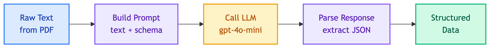

# **🔄 Extractor**

LLM-based structured data extraction using provider/selector pattern.

---

## **📍 Location**

[`ingestor/extractor/`](../../../ingestor/extractor/)

---

## **🔄 Flow**

📊 Extraction Flow

---

## **📦 Providers**

| | |
|:---:|:---:|
| [🤖 **LiteLLM**](litellm.md) LiteLLM-based extraction | |

---

## **🔧 Classes**

### 🎯 **BaseExtractor**

Abstract base class for extractors.

**Location**: `ingestor/extractor/base.py`

**Methods**:

| Method | Description |
|--------|-------------|
| `extract(text, **kwargs)` | Extract structured data from text |

### 🔀 **ExtractorSelector**

Selector for extractor providers.

**Location**: `ingestor/extractor/selector.py`

**Methods**:

| Method | Description |
|--------|-------------|
| `create(provider, **kwargs)` | Create extractor instance |
| `list_providers()` | List available providers |
