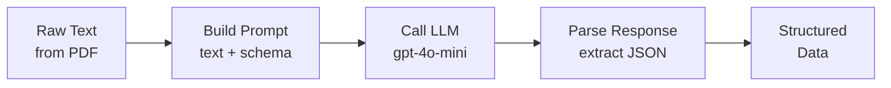

# **🔧 How It Works**

---

## **📋 Overview**

The extractor uses LLM to convert raw PDF text into structured product data.

---

## **🔄 Flow**

---

## **📜 Prompt Template**

**Location**: [prompts/ingestor/extract_product.prompt](../../../prompts/ingestor/extract_product.prompt)

The extractor sends a prompt asking LLM to extract:

| Field | Description |
|-------|-------------|
| `product_name` | Product name from title |
| `description` | Description paragraph |
| `specifications` | Key-value pairs (type, category, dimensions, etc.) |
| `features` | List of features with title and description |
| `summary` | Closing summary paragraph |
