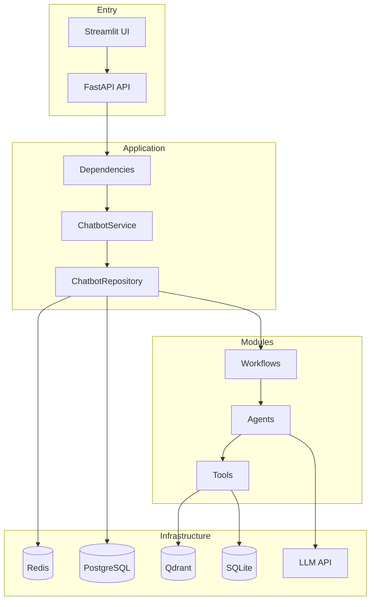
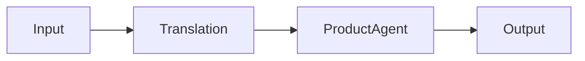
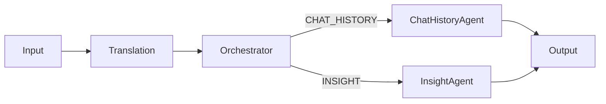

# Multi-Agent Systems

Documentation for the MTL Agent multi-agent chatbot system.

## Overview

Two LangGraph-based chatbot workflows:

| Chatbot | Target Users | Purpose |
|---------|--------------|---------|
| **Customer Chatbot** | External (shoppers) | Product search, orders, support |
| **Client Chatbot** | Internal (BI analysts) | Analytics, insights, visualization |

## Documentation

| Section | Description | Link |
|---------|-------------|------|
| **Architecture** | Code and system architecture | [architecture/README.md](architecture/README.md) |
| **Modules** | Workflows, agents, tools | [modules/README.md](modules/README.md) |
| **Repositories** | Data access layer | [repositories/README.md](repositories/README.md) |
| **Usecases** | Business orchestration | [usecases/README.md](usecases/README.md) |
| **Dependencies** | Dependency injection | [dependencies/README.md](dependencies/README.md) |
| **Configs** | Configuration files | [configs/README.md](configs/README.md) |
| **API** | REST API endpoints | [api/README.md](api/README.md) |
| **CLI** | Command-line interface | [cli/README.md](cli/README.md) |

## System Architecture



## Chatbot Workflows

### Customer Chatbot



**Tools**: SQL (product, order), VectorDB (search, similar)

### Client Chatbot



**Tools**: SQL (analytics, chat_history), Visualization (charts)

## Quick Start

```bash
# Start API server
python main.py api

# Start Customer UI
python main.py customer_ui

# Start Client UI
python main.py client_ui
```

## Design Decisions

| Decision | Link |
|----------|------|
| ReAct & LangGraph | [why_react_and_langgraph.md](../decisions/why_react_and_langgraph.md) |
| Checkpointer + Store | [why_checkpointer_and_store.md](../decisions/why_checkpointer_and_store.md) |
| OpenAI Model | [why_openai_model.md](../decisions/why_openai_model.md) |
| Langfuse | [why_langfuse.md](../decisions/why_langfuse.md) |

## Future Improvements

| Improvement | Link |
|-------------|------|
| Workflow Orchestrator | [workflow_orchestrator.md](../future_improvements/workflow_orchestrator.md) |
| Async Store Writes | [async_store_writes.md](../future_improvements/async_store_writes.md) |
| Embedding Models | [embedding_models.md](../future_improvements/embedding_models.md) |
