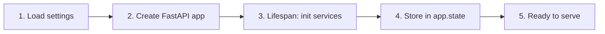

# API

REST API layer for multi-agent chatbots.

## Location

`src/api/`

## Overview

```mermaid
flowchart TD
    subgraph FastAPI
        A[app.py]
    end
    
    subgraph Routes
        R1[/api/v1/chatbot/customer]
        R2[/api/v1/chatbot/client]
    end
    
    subgraph Services
        S1[CustomerChatbotService]
        S2[ClientChatbotService]
    end
    
    A --> R1
    A --> R2
    R1 --> S1
    R2 --> S2
```

## Endpoints

| Endpoint | Method | Documentation |
|----------|--------|---------------|
| /api/v1/chatbot/customer/chat | POST | [customer_chat.md](customer_chat.md) |
| /api/v1/chatbot/client/chat | POST | [client_chat.md](client_chat.md) |
| /health | GET | Health check |

## File Structure

```
src/api/
├── app.py                          # FastAPI application factory
├── routes/
│   ├── health.py                   # Health check endpoint
│   └── chatbots/
│       ├── customer.py             # Customer chatbot routes
│       └── client.py               # Client chatbot routes
└── schemas/
    └── chatbots/
        ├── customer.py             # Customer request/response models
        └── client.py               # Client request/response models
```

## Application Lifecycle



## Service Injection

Services are initialized in `lifespan` and stored in `app.state`:

```python
@asynccontextmanager
async def lifespan(app: FastAPI):
    app.state.customer_chatbot_service = build_chatbot_service()
    app.state.client_chatbot_service = build_client_chatbot_service()
    yield
```

## Full Code

See [`src/api/app.py`](../../../src/api/app.py)
