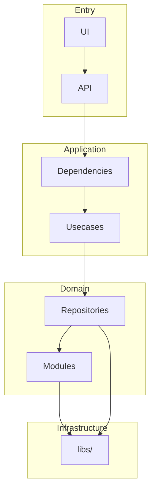
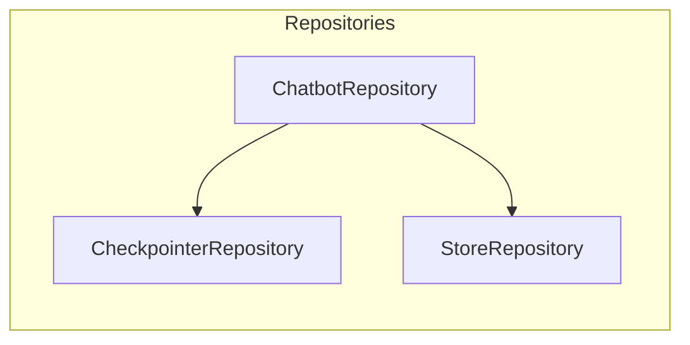
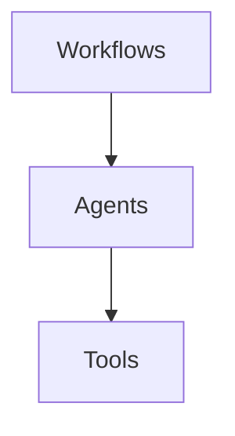
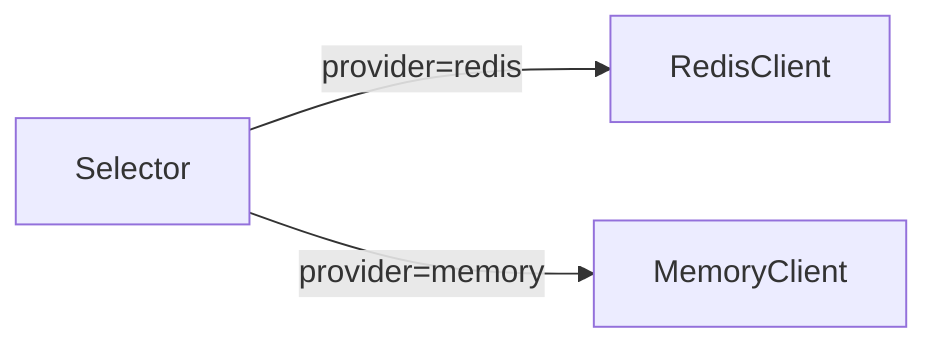

# Code Architecture

Clean Architecture with Repository Pattern and Dependency Injection.

## Patterns

| Pattern | Purpose | Implementation |
|---------|---------|----------------|
| Clean Architecture | Layer separation | API → Usecases → Repositories → Modules |
| Repository Pattern | Data access abstraction | `src/repositories/` |
| Dependency Injection | Component decoupling | `src/dependencies/` |
| Selector Pattern | Provider swapping | `libs/*/selector.py` |

## Layer Diagram



## Layers

| Layer | Location | Responsibility |
|-------|----------|----------------|
| UI | `ui/` | Streamlit frontend |
| API | `src/api/` | HTTP endpoints, request/response |
| Dependencies | `src/dependencies/` | DI wiring, service factory |
| Usecases | `src/usecases/` | Business logic orchestration |
| Repositories | `src/repositories/` | Chatbots, checkpointers, stores |
| Modules | `src/modules/` | Workflows, agents, tools |
| Infrastructure | `libs/` | Generic clients, configs |

## Repository Layer



| Repository | Purpose |
|------------|---------|
| `chatbots/` | Compile workflow + manage memory |
| `checkpointers/` | Short-term memory (Redis, TTL-based) |
| `stores/` | Long-term memory (Postgres, permanent) |

## Modules Layer



| Module | Purpose |
|--------|---------|
| `workflows/` | LangGraph StateGraph definitions |
| `agents/` | LLM-powered decision makers |
| `tools/` | Domain logic (SQL, VectorDB, Visualization) |

## libs/ vs repositories/

| Layer | Scope | Reusability | Example |
|-------|-------|-------------|---------|
| `libs/` | Generic infrastructure | Cross-project | `RedisClient`, `PostgresClient` |
| `repositories/` | Domain-specific | Project-specific | `RedisCheckpointerRepository` |

## Selector Pattern



Selectors enable swapping providers without changing business logic:

```python
# libs/database/key_value/selector.py
class KeyValueSelector:
    @staticmethod
    def create(provider: str) -> BaseKeyValue:
        if provider == "redis":
            return RedisClient()
        elif provider == "memory":
            return MemoryClient()
```

## File Structure

```
src/
├── api/                    # HTTP endpoints
│   ├── app.py              # FastAPI factory
│   ├── routes/             # Route handlers
│   └── schemas/            # Request/response models
├── dependencies/           # DI wiring
│   ├── client_chatbot.py   # Client chatbot factory
│   └── customer_chatbot.py # Customer chatbot factory
├── usecases/               # Business orchestration
│   └── chatbot/main.py     # ChatbotService
├── repositories/           # Data access
│   ├── chatbots/           # Workflow + memory
│   ├── checkpointers/      # Short-term (Redis)
│   └── stores/             # Long-term (Postgres)
└── modules/                # Core logic
    ├── workflows/          # LangGraph graphs
    ├── agents/             # LLM agents
    └── tools/              # Domain tools
```

## References

- [Repositories](../repositories/README.md)
- [Modules](../modules/README.md)
- [Dependencies](../dependencies/README.md)
