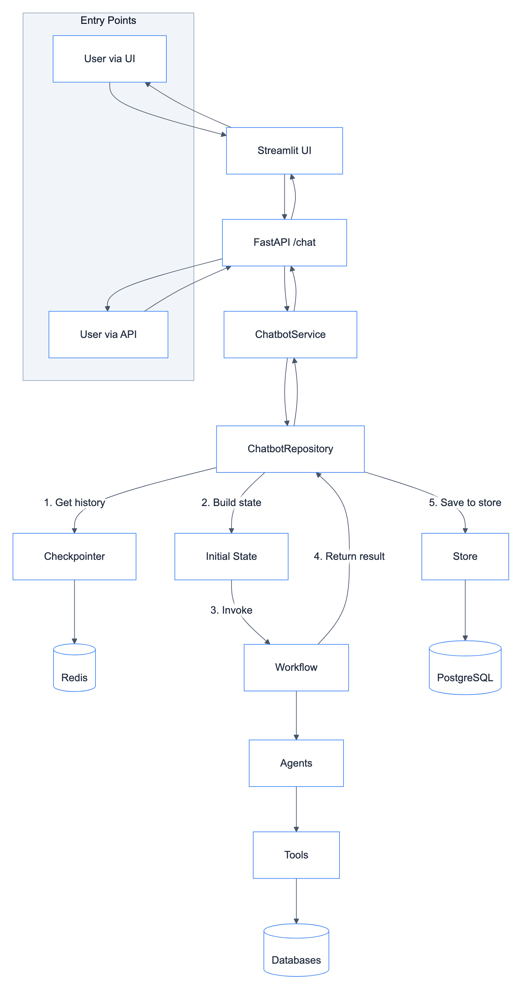
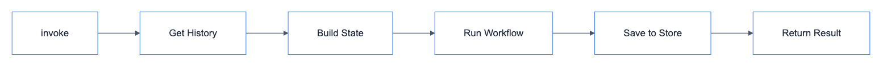
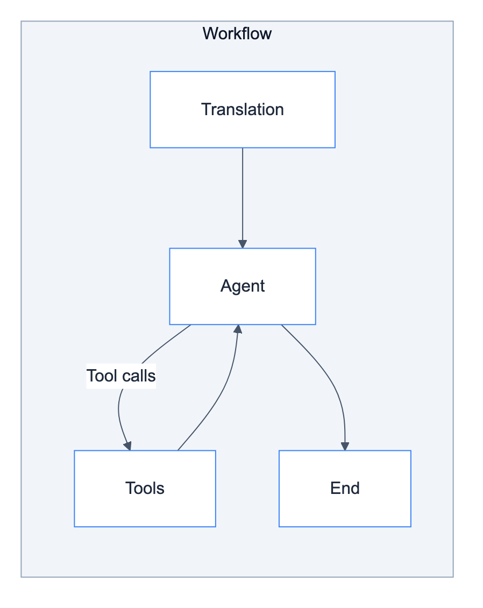
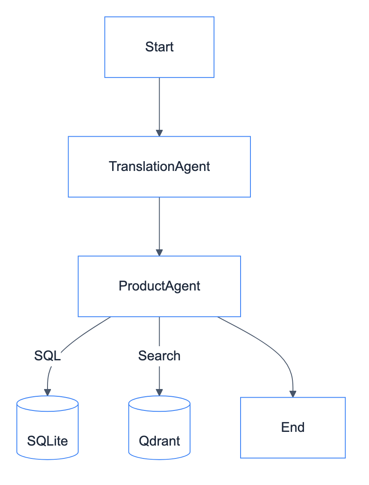
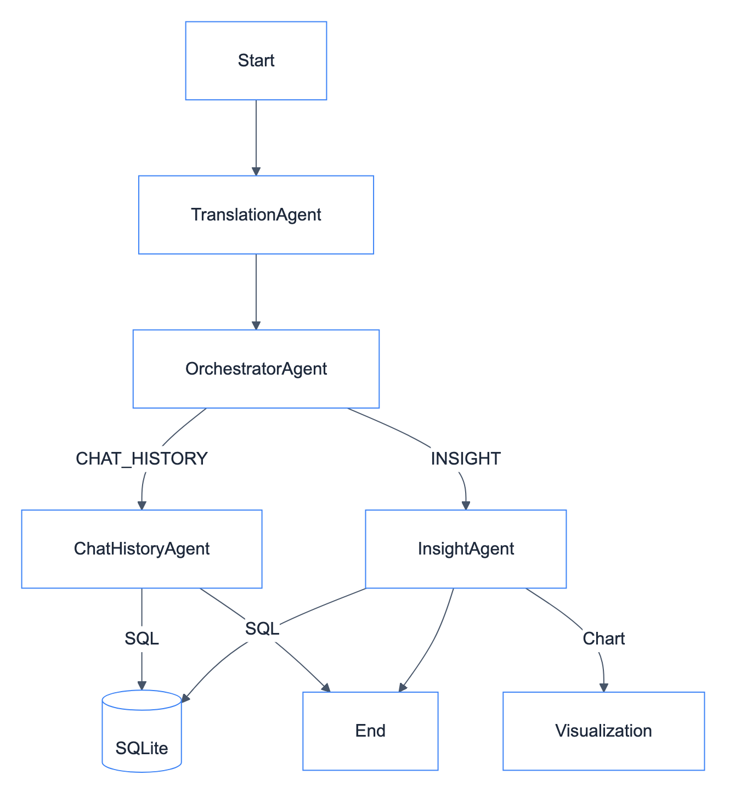

# System Architecture

Request lifecycle from user to response.

## Request Flow



## Entry Points

| Entry | Path | Use Case |
|-------|------|----------|
| UI | User → Streamlit → API | Interactive chat interface |
| API | User → API directly | Integration, testing, automation |

## Step-by-Step Flow

### 1. User Request

**Via UI:**
```
User → Streamlit UI → POST /api/v1/chatbot/{type}/chat
```

**Via API:**
```
User → POST /api/v1/chatbot/{type}/chat
```

| Step | Component | Action |
|------|-----------|--------|
| 1 | Entry | User sends message (UI or API) |
| 2 | API | Route handler receives request |
| 3 | API | Calls `ChatbotService.chat()` |

### 2. Repository Processing

```
ChatbotService → ChatbotRepository.invoke()
```



| Step | Method | Action |
|------|--------|--------|
| 1 | `get_history()` | Fetch messages from Redis checkpointer |
| 2 | Build state | Create initial state with query + history |
| 3 | `app.invoke()` | Run compiled workflow |
| 4 | `_save_to_store()` | Persist to PostgreSQL store |

### 3. Workflow Execution



| Step | Node | Action |
|------|------|--------|
| 1 | Translation | Detect language, translate if needed |
| 2 | Agent | Process query, decide tool usage |
| 3 | Tools | Execute SQL, VectorDB, Visualization |
| 4 | Agent | Generate final response |

### 4. Memory Management

See [why_checkpointer_and_store.md](../../decisions/why_checkpointer_and_store.md) for detailed explanation.

| Memory | Storage | TTL | Purpose |
|--------|---------|-----|---------|
| Checkpointer | Redis | 60 min | Per-thread state snapshots |
| Store | PostgreSQL | Permanent | Long-term backup |

### 5. Response Return

**Via UI:**
```
Result → API → Streamlit UI → User
```

**Via API:**
```
Result → API → User
```

## Customer Chatbot Flow



## Client Chatbot Flow



## State Schema

### Initial State (Input)

| Field | Type | Description |
|-------|------|-------------|
| `messages` | `list[BaseMessage]` | History from checkpointer |
| `query` | `str` | User's question |
| `customer_id` | `str` | User identifier |
| `user_language` | `None` | Detected later |

### Final State (Output)

| Field | Type | Description |
|-------|------|-------------|
| `messages` | `list[BaseMessage]` | Updated history |
| `response` | `str` | Final answer |
| `steps` | `list[dict]` | Execution trace |
| `error` | `str` | Error if any |

## References

- [Repositories](../repositories/README.md) - ChatbotRepository details
- [Modules](../modules/README.md) - Workflow and agent details
- [API](../api/README.md) - Endpoint details
