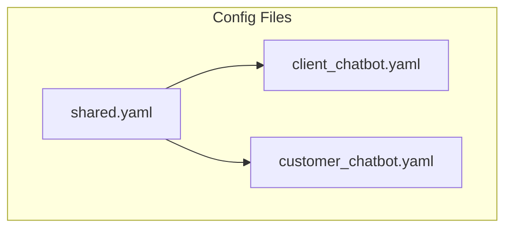

# Configs

Configuration files for multi-agent chatbots.

## Location

`configs/agents/`

## Overview

## Config Files

| File | Purpose | Documentation |
|------|---------|---------------|
| shared.yaml | Common settings (LLM, observability, databases) | [shared.md](shared.md) |
| client_chatbot.yaml | Client chatbot agents and tools | [client_chatbot.md](client_chatbot.md) |
| customer_chatbot.yaml | Customer chatbot agents and tools | [customer_chatbot.md](customer_chatbot.md) |

## References

- [Dynaconf](../../libs/configs/dynaconf.md) - Config library documentation
