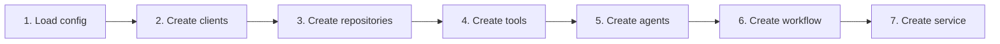

# build_client_chatbot_service

Dependency injection for client (internal BI) chatbot.

## Location

`src/dependencies/client_chatbot.py`

## Function

```python
def build_client_chatbot_service() -> ChatbotService
```

## Code Flow



## Components Created

### Clients

| Client | Provider | Purpose |
|--------|----------|---------|
| langchain_client | langchain | LLM for agents |
| chat_history_sql_llm_client | langchain | LLM for chat history SQL tool |
| analytics_sql_llm_client | langchain | LLM for analytics SQL tool |
| viz_llm_client | langchain | LLM for visualization tool |
| postgres_client | postgres | PostgreSQL for chat history |
| sqlite_client | sqlite | SQLite for ERP data |
| observability | langfuse | Tracing |
| prompt_manager | langfuse | Prompt management |

### Repositories

| Repository | Type | Purpose |
|------------|------|---------|
| checkpoint_repo | RedisCheckpointerRepository | Short-term memory |
| store_repo | None | No long-term memory (internal tool) |

### Tools

| Tool | Class | Purpose |
|------|-------|---------|
| chat_history_sql_tool | ClientChatHistorySQLTool | Query chat history from Postgres |
| analytics_sql_tool | ClientAnalyticsSQLTool | Query ERP data from SQLite |
| visualization_tool | VisualizationTool | Generate Plotly charts |

### Agents

| Agent | Class | Tools |
|-------|-------|-------|
| translation_agent | TranslationAgent | - |
| orchestrator_agent | OrchestratorAgent | - |
| chat_history_agent | CustomerChatHistoryAgent | chat_history_sql_tool |
| insight_agent | CustomerInsightAgent | analytics_sql_tool, visualization_tool |

### Workflow & Service

| Component | Class |
|-----------|-------|
| workflow | ClientChatbotWorkflow |
| chatbot_repo | ClientChatbotRepository |
| service | ChatbotService |

## Usage

```python
from src.dependencies.client_chatbot import build_client_chatbot_service

service = build_client_chatbot_service()
result = service.chat(
    query="ยอดขายเดือนนี้",
    thread_id="thread-123",
    user_id="user-456",
)
```

## Full Code

See [`src/dependencies/client_chatbot.py`](../../../src/dependencies/client_chatbot.py)
