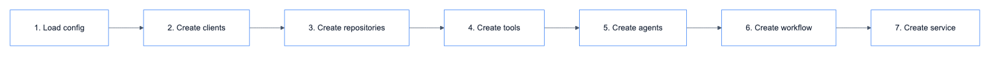

# build_chatbot_service

Dependency injection for customer (shopping assistant) chatbot.

## Location

`src/dependencies/customer_chatbot.py`

## Function

```python
def build_chatbot_service() -> ChatbotService
```

## Code Flow



## Components Created

### Clients

| Client | Provider | Purpose |
|--------|----------|---------|
| langchain_client | langchain | LLM for agents |
| product_sql_llm_client | langchain | LLM for product SQL tool |
| order_sql_llm_client | langchain | LLM for order SQL tool |
| place_order_sql_llm_client | langchain | LLM for place order tool |
| cancel_order_sql_llm_client | langchain | LLM for cancel order tool |
| vector_llm_client | langchain | LLM for vector search (embedding) |
| sql_client | sqlite | SQLite for ERP data |
| vector_store | qdrant | Qdrant for product search |
| observability | langfuse | Tracing |
| prompt_manager | langfuse | Prompt management |

### Repositories

| Repository | Type | Purpose |
|------------|------|---------|
| checkpoint_repo | RedisCheckpointerRepository | Short-term memory |
| store_repo | PostgresStoreRepository | Long-term memory |

### Tools

| Tool | Class | Purpose |
|------|-------|---------|
| product_sql_tool | CustomerProductSQLTool | Query products/inventory |
| order_sql_tool | CustomerOrderSQLTool | Query order history |
| place_order_sql_tool | PlaceOrderSQLTool | Create new orders |
| cancel_order_sql_tool | CancelOrderSQLTool | Cancel orders |
| product_search_tool | ProductSearchTool | Semantic product search |
| similar_products_tool | SimilarProductsTool | Find similar products |

### Agents

| Agent | Class | Tools |
|-------|-------|-------|
| translation_agent | TranslationAgent | - |
| product_agent | ProductAgent | All 6 tools above |

### Workflow & Service

| Component | Class |
|-----------|-------|
| workflow | CustomerChatbotWorkflow |
| chatbot_repo | CustomerChatbotRepository |
| service | ChatbotService |

## Usage

```python
from src.dependencies.customer_chatbot import build_chatbot_service

service = build_chatbot_service()
result = service.chat(
    query="หาลำโพง bluetooth",
    thread_id="thread-123",
    user_id="user-456",
)
```

## Full Code

See [`src/dependencies/customer_chatbot.py`](../../../src/dependencies/customer_chatbot.py)
