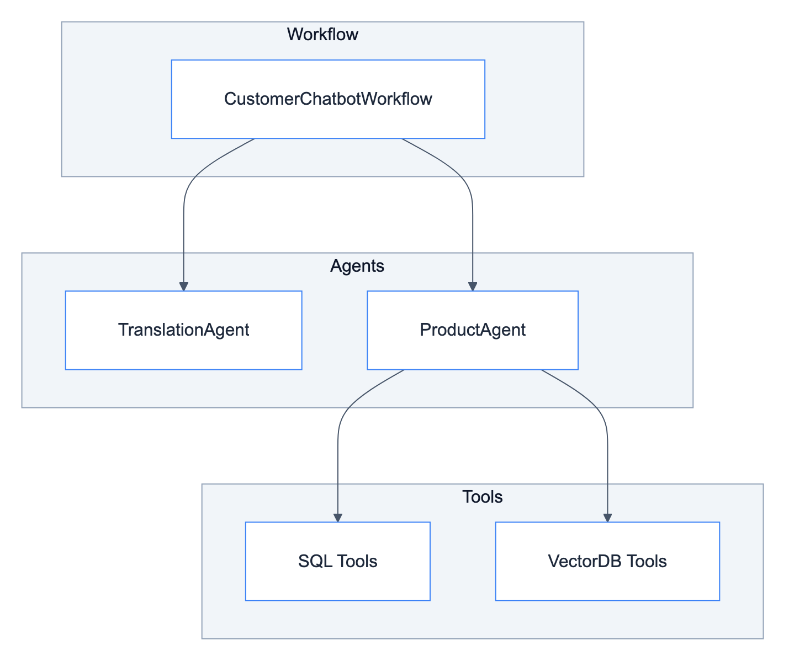
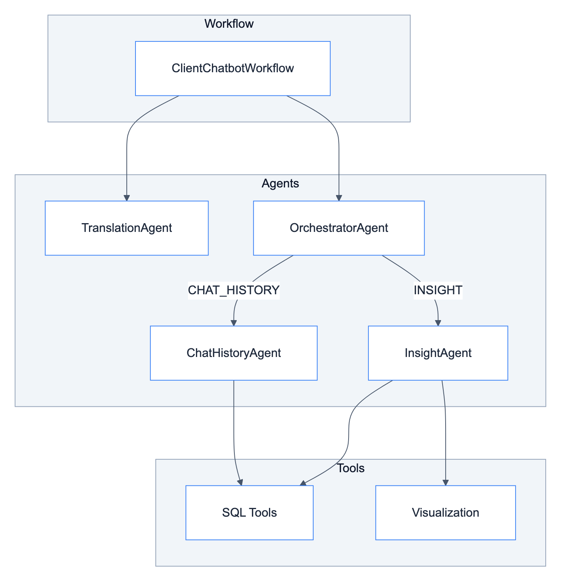

# **📦 Modules**

Core building blocks for multi-agent systems.


---


## **📍 Location**

[`src/modules/`](../../../src/modules/)


---


## **📋 Overview**

Modules are the main components that power the chatbot systems. They follow a layered architecture where workflows orchestrate agents, and agents use tools.


### 👤 **Customer Chatbot Flow**




### 💼 **Client Chatbot Flow**




---


## **🧩 Components**

| | | |
|:---:|:---:|:---:|
| [🔄 **Workflows**](workflows/README.md)<br/>Graph orchestrators | [🤖 **Agents**](agents/README.md)<br/>LLM-powered decision makers | [🔧 **Tools**](tools/README.md)<br/>Domain logic executors |


---


## **📝 Design Decisions**

| Decision | Description | Applies To | Link |
|----------|-------------|------------|------|
| ReAct & LangGraph | When to use ReAct agents vs LangGraph workflows | All agents, workflows | [why_react_and_langgraph.md](../../decisions/why_react_and_langgraph.md) |
| Checkpointer + Store | Redis for short-term, Postgres for long-term memory | All workflows | [why_checkpointer_and_store.md](../../decisions/why_checkpointer_and_store.md) |
| OpenAI Model | Model selection rationale | All agents | [why_openai_model.md](../../decisions/why_openai_model.md) |
| LiteLLM | Centralized LLM gateway | All agents | [why_litellm.md](../../decisions/why_litellm.md) |
| Langfuse | Observability and prompt management | All agents, tools | [why_langfuse.md](../../decisions/why_langfuse.md) |


---


## **🔮 Future Improvements**

| Improvement | Description | Improves | Link |
|-------------|-------------|----------|------|
| Embedding Models | Better semantic search | ProductAgent, VectorDB tools | [embedding_models.md](../../future_improvements/ingestion/embedding_models.md) |
| Search Algorithms | Hybrid search strategies | ProductAgent, VectorDB tools | [search_algorithms.md](../../future_improvements/ingestion/search_algorithms.md) |
| Structured Payload | Type-safe tool outputs | All tools | [structured_payload.md](../../future_improvements/ingestion/structured_payload.md) |
| Context Engineering | Managing LLM context windows | All agents | [context_engineering.md](../../future_improvements/context_engineering.md) |
| Deep Agents Integration | LangChain Deep Agents patterns | All workflows | [deep_agents_integration.md](../../future_improvements/deep_agents_integration.md) |
| Caching Strategy | LiteLLM, semantic cache, embedding cache | All agents | [caching.md](../../future_improvements/infrastructure/caching.md) |
| Self-Hosted LLM | vLLM, Ollama deployment | All agents | [self_hosted_llm.md](../../future_improvements/infrastructure/self_hosted_llm.md) |


---


## **📂 File Structure**

```
src/modules/
├── workflows/
│   ├── base.py                    # BaseWorkflow abstract class
│   ├── client_chatbot/            # Client workflow
│   └── customer_chatbot/          # Customer workflow
├── agents/
│   ├── base.py                    # BaseAgent abstract class
│   ├── translation/main.py        # TranslationAgent
│   ├── products/main.py           # ProductAgent
│   └── client/
│       ├── orchestrator.py        # OrchestratorAgent
│       ├── insight.py             # CustomerInsightAgent
│       └── chat_history.py        # CustomerChatHistoryAgent
└── tools/
    ├── knowledge_retrieval/
    │   ├── sql/                   # SQL tools
    │   └── vectordb/              # VectorDB tools
    └── visualization/             # Chart tools
```
