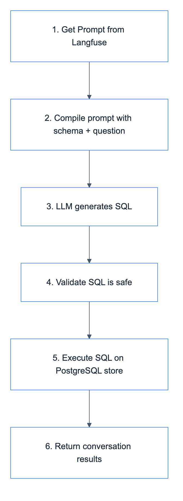

# Client Chat History SQL Tool

Query customer chat conversation history from PostgreSQL store.

## Location

`src/modules/tools/knowledge_retrieval/sql/client/chat_history.py`

## Prompt

[tools_client_chat_history_sql](../../../../../../prompts/tools/client/chat_history_sql.md)

## Class: ClientChatHistorySQLTool

Inherits from `SQLTool`.

### Purpose

Find what customers asked or said in previous conversations. Queries the LangGraph store table.

### Configuration

| Property | Value |
|----------|-------|
| Tables | store (LangGraph) |
| Write | No (read-only) |
| Filter | None |
| Prompt | `tools_client_chat_history_sql` |

### Input Schema

| Field | Type | Description |
|-------|------|-------------|
| `question` | str | Question about chat conversation history |

### Code Flow



### Usage

```python
from src.modules.tools.knowledge_retrieval.sql.client.chat_history import ClientChatHistorySQLTool

tool = ClientChatHistorySQLTool(
    sql_client=postgres_client,  # PostgreSQL for LangGraph store
    llm_client=llm_client,
    prompt_manager=prompt_manager,
)

# Example queries
tool._run("What did customer 123 ask last week?")
tool._run("Find conversations about refunds")
```

### Example Questions

- "What did customer 123 ask last week?"
- "Find conversations about product returns"
- "Show me complaints from yesterday"
- "Which customers asked about pricing?"
