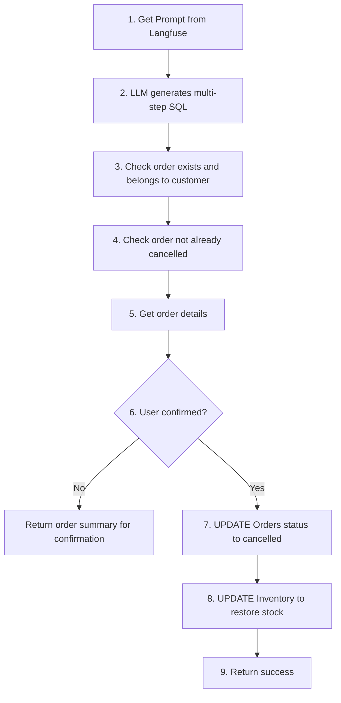

# Cancel Order SQL Tool

Cancel orders for customers using LLM-generated SQL.

## Location

`src/modules/tools/knowledge_retrieval/sql/customer/cancel_order.py`

## Class: CancelOrderSQLTool

Inherits from `SQLTool`.

### Purpose

Cancel customer orders. Verifies ownership, updates status, and restores inventory. Requires explicit user confirmation.

### Configuration

| Property | Value |
|----------|-------|
| Tables | Orders, OrderDetails, Inventory |
| Write | Yes (UPDATE enabled) |
| Filter | `customer_id` required |
| Prompt | `tools_customer_cancel_order_sql` |

### Input Schema

| Field | Type | Description |
|-------|------|-------------|
| `order_id` | int | Order ID to cancel |
| `confirmed` | bool | Set true only after user confirms |

### Code Flow



### Two-Step Confirmation

1. **First call** (`confirmed=false`): Returns order details, NO database write
2. **Second call** (`confirmed=true`): Actually cancels the order

### Usage

```python
from src.modules.tools.knowledge_retrieval.sql.customer.cancel_order import CancelOrderSQLTool

tool = CancelOrderSQLTool(
    sql_client=sql_client,
    llm_client=llm_client,
    prompt_manager=prompt_manager,
    allowed_tables=["Orders", "OrderDetails", "Inventory"],
    customer_id="cust_123",
)

# Step 1: Get order details
result = tool._run(order_id=1001, confirmed=False)
# Returns: {"needs_confirmation": True, "order_id": 1001, "products": ["2x iPhone"], ...}

# Step 2: Confirm cancellation
result = tool._run(order_id=1001, confirmed=True)
# Returns: {"success": True, "new_status": "cancelled", ...}
```

### Return Format

**Before confirmation:**
```python
{
    "success": True,
    "needs_confirmation": True,
    "order_id": 1001,
    "order_date": "2024-01-15",
    "total_amount": 1998,
    "status": "pending",
    "products": ["2x iPhone 15"],
    "message": "Please confirm: Cancel Order #1001 (2x iPhone 15) for $1998?"
}
```

**After confirmation:**
```python
{
    "success": True,
    "order_id": 1001,
    "previous_status": "pending",
    "new_status": "cancelled",
    "stages": {...}  # SQL executed at each stage
}
```

### Security

- **Ownership check**: Only orders belonging to the customer can be cancelled
- **Status check**: Already cancelled orders are rejected
- **Inventory restore**: Stock is returned when order is cancelled
