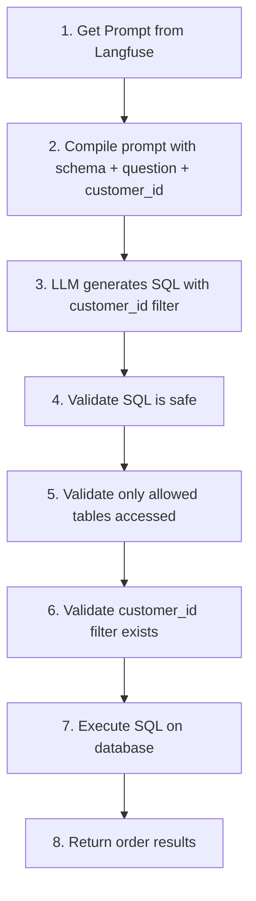

# Customer Order SQL Tool

Order history queries for customers (filtered by customer_id).

## Location

`src/modules/tools/knowledge_retrieval/sql/customer/order.py`

## Class: CustomerOrderSQLTool

Inherits from `SQLTool`.

### Purpose

Query customer's own order history - orders, order status, and purchase history. Uses customer_id filter to ensure data isolation.

### Configuration

| Property | Value |
|----------|-------|
| Tables | Orders, OrderDetails (restricted) |
| Write | No (read-only) |
| Filter | `customer_id` required in all queries |
| Prompt | `tools_customer_order_sql` |

### Input Schema

| Field | Type | Description |
|-------|------|-------------|
| `question` | str | Question about your orders |

### Code Flow



### Security

- **Customer isolation**: All queries must include `customer_id` filter
- **Table restriction**: Only Orders and OrderDetails accessible
- **No cross-customer access**: Cannot view other customers' orders

### Usage

```python
from src.modules.tools.knowledge_retrieval.sql.customer.order import CustomerOrderSQLTool

tool = CustomerOrderSQLTool(
    sql_client=sql_client,
    llm_client=llm_client,
    prompt_manager=prompt_manager,
    allowed_tables=["Orders", "OrderDetails"],
    customer_id="cust_123",
)

# Or set customer_id later
tool.set_customer_id("cust_456")

# Example queries
tool._run("Show my recent orders")
tool._run("What is the status of my last order?")
```

### Example Questions

- "Show my recent orders"
- "What is the status of my last order?"
- "How much did I spend last month?"
- "What did I order on January 5th?"
