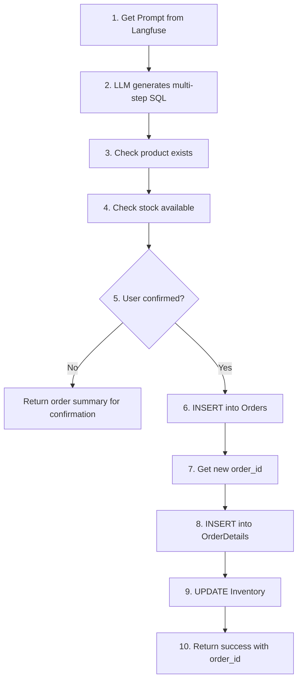

# Place Order SQL Tool

Create orders for customers using LLM-generated SQL.

## Location

`src/modules/tools/knowledge_retrieval/sql/customer/place_order.py`

## Class: PlaceOrderSQLTool

Inherits from `SQLTool`.

### Purpose

Place orders for products. Requires explicit user confirmation before writing to database.

### Configuration

| Property | Value |
|----------|-------|
| Tables | Orders, OrderDetails, Inventory |
| Write | Yes (INSERT, UPDATE enabled) |
| Filter | `customer_id` required |
| Prompt | `tools_customer_place_order_sql` |

### Input Schema

| Field | Type | Description |
|-------|------|-------------|
| `product_id` | int | Product ID to order |
| `quantity` | int | Quantity to order (>= 1) |
| `confirmed` | bool | Set true only after user confirms |

### Code Flow



### Two-Step Confirmation

1. **First call** (`confirmed=false`): Returns order summary, NO database write
2. **Second call** (`confirmed=true`): Actually places the order

### Usage

```python
from src.modules.tools.knowledge_retrieval.sql.customer.place_order import PlaceOrderSQLTool

tool = PlaceOrderSQLTool(
    sql_client=sql_client,
    llm_client=llm_client,
    prompt_manager=prompt_manager,
    allowed_tables=["Orders", "OrderDetails", "Inventory", "Products"],
    customer_id="cust_123",
)

# Step 1: Get order summary
result = tool._run(product_id=5, quantity=2, confirmed=False)
# Returns: {"needs_confirmation": True, "product_name": "iPhone", "total_price": 1998, ...}

# Step 2: Confirm order
result = tool._run(product_id=5, quantity=2, confirmed=True)
# Returns: {"success": True, "order_id": 1001, ...}
```

### Return Format

**Before confirmation:**
```python
{
    "success": True,
    "needs_confirmation": True,
    "product_id": 5,
    "product_name": "iPhone 15",
    "quantity": 2,
    "price_per_unit": 999,
    "total_price": 1998,
    "available_stock": 50,
    "message": "Please confirm: Order 2x iPhone 15 for $1998?"
}
```

**After confirmation:**
```python
{
    "success": True,
    "order_id": 1001,
    "product_id": 5,
    "quantity": 2,
    "stages": {...}  # SQL executed at each stage
}
```
