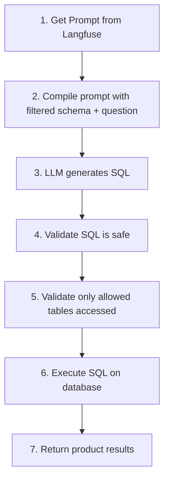

# Customer Product SQL Tool

Product and inventory queries for customers.

## Location

`src/modules/tools/knowledge_retrieval/sql/customer/product.py`

## Class: CustomerProductSQLTool

Inherits from `SQLTool`.

### Purpose

Query product information - details, prices, stock levels, and inventory. Restricted to product-related tables only.

### Configuration

| Property | Value |
|----------|-------|
| Tables | Products, Inventory (restricted) |
| Write | No (read-only) |
| Filter | `allowed_tables` validation |
| Prompt | `tools_customer_product_sql` |

### Input Schema

| Field | Type | Description |
|-------|------|-------------|
| `question` | str | Question about products or inventory |

### Code Flow



### Security

- **Schema filtering**: Only Products and Inventory tables shown to LLM
- **Table validation**: Rejects queries accessing Orders, Customers, etc.

### Usage

```python
from src.modules.tools.knowledge_retrieval.sql.customer.product import CustomerProductSQLTool

tool = CustomerProductSQLTool(
    sql_client=sql_client,
    llm_client=llm_client,
    prompt_manager=prompt_manager,
    allowed_tables=["Products", "Inventory", "Warehouses"],
)

# Example queries
tool._run("Show me all laptops under $1000")
tool._run("Is the iPhone 15 in stock?")
```

### Example Questions

- "Show me all laptops under $1000"
- "Is the iPhone 15 in stock?"
- "What colors are available for product X?"
- "Which products are on sale?"
