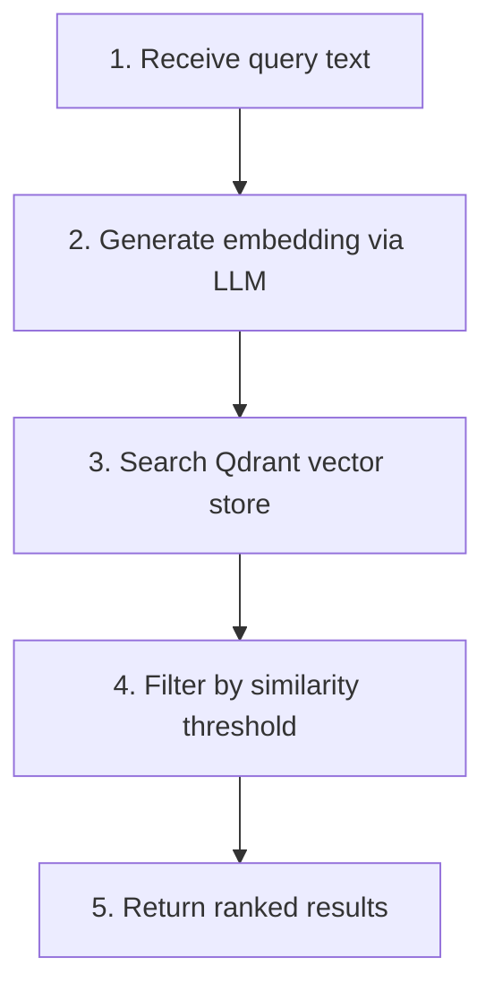

# Product Search Tool

Semantic search for products using text queries.

## Location

`src/modules/tools/knowledge_retrieval/vectordb/search.py`

## Class: ProductSearchTool

Inherits from `langchain.tools.BaseTool`.

### Purpose

Search for products using semantic similarity. Converts text query to embedding and finds matching products in Qdrant.

### Configuration

| Property | Value |
|----------|-------|
| Vector Store | Qdrant |
| Embedding | LLM client |
| Threshold | Configurable (default 0.5) |

### Input Schema

| Field | Type | Default | Description |
|-------|------|---------|-------------|
| `query` | str | required | Search query text |
| `top_k` | int | 10 | Number of results |
| `similarity_threshold` | float | 0.5 | Minimum similarity score |

### Code Flow



### Usage

```python
from src.modules.tools.knowledge_retrieval.vectordb.search import ProductSearchTool

tool = ProductSearchTool(
    vector_store=vector_store,
    llm_client=llm_client,
    similarity_threshold=0.5,
)

result = tool._run(query="wireless speaker", top_k=5)
# Returns: {"query": "wireless speaker", "results": [...]}
```

### Return Format

```python
{
    "query": "wireless speaker",
    "results": [
        {"product_id": 14, "score": 0.5619, "metadata": {...}},
        {"product_id": 6, "score": 0.5294, "metadata": {...}},
    ]
}
```

### Example Questions

- "wireless bluetooth speaker"
- "laptop for gaming"
- "office chair ergonomic"
