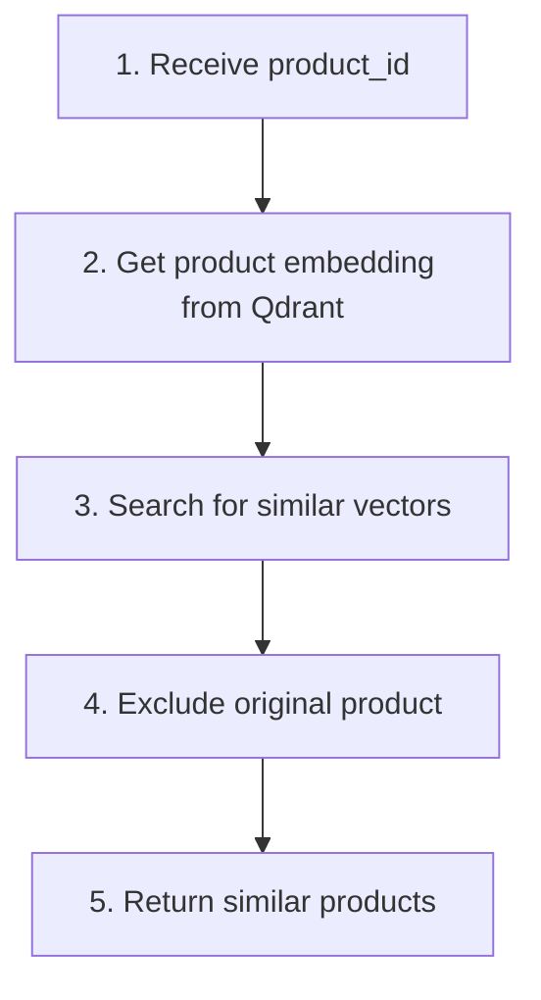

# Similar Products Tool

Find products similar to a given product.

## Location

`src/modules/tools/knowledge_retrieval/vectordb/similar.py`

## Class: SimilarProductsTool

Inherits from `langchain.tools.BaseTool`.

### Purpose

Find similar products based on vector similarity. Gets the embedding of a product and finds nearest neighbors in Qdrant.

### Configuration

| Property | Value |
|----------|-------|
| Vector Store | Qdrant |
| Embedding | Retrieved from store |

### Input Schema

| Field | Type | Default | Description |
|-------|------|---------|-------------|
| `product_id` | int | required | Base product ID |
| `top_k` | int | 5 | Number of similar products |

### Code Flow



### Usage

```python
from src.modules.tools.knowledge_retrieval.vectordb.similar import SimilarProductsTool

tool = SimilarProductsTool(
    vector_store=vector_store,
    llm_client=llm_client,
)

result = tool._run(product_id=14, top_k=3)
# Returns: {"product_id": 14, "results": [...]}
```

### Return Format

```python
{
    "product_id": 14,
    "results": [
        {"product_id": 25, "score": 0.6698, "metadata": {...}},
        {"product_id": 6, "score": 0.6663, "metadata": {...}},
        {"product_id": 69, "score": 0.6602, "metadata": {...}},
    ]
}
```

### Use Cases

- "Show me products similar to this one"
- Product recommendations
- "Customers also bought" suggestions
