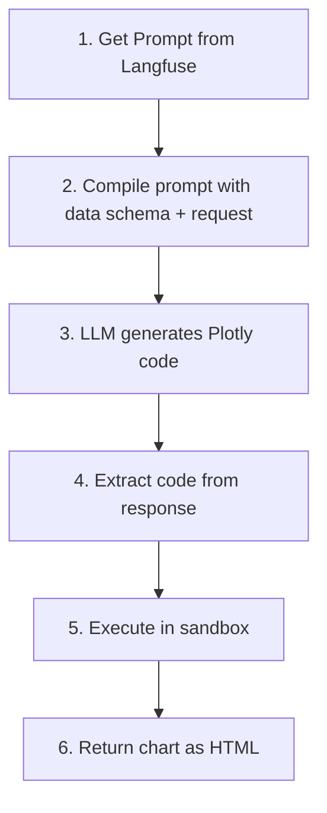

# Visualization Tool

Create Plotly visualizations using LLM-generated code.

## Location

`src/modules/tools/visualization/main.py`

## Class: VisualizationTool

Inherits from `langchain.tools.BaseTool`.

### Purpose

Create Plotly charts from data using natural language requests. Uses LLM to generate Plotly code, then executes in a sandboxed environment.

### Configuration

| Property | Value |
|----------|-------|
| LLM | Code generation |
| Sandbox | Restricted Python execution |
| Output | HTML string |
| Prompt | `tools_client_visualization` |

### Input Schema

| Field | Type | Description |
|-------|------|-------------|
| `data` | list[dict] | Data to visualize |
| `request` | str | Natural language description of the chart |

### Code Flow



### Sandbox Security

The tool executes LLM-generated code in a restricted environment:

**Allowed:**
- `pd` (pandas), `px` (plotly.express), `go` (plotly.graph_objects)
- `df`, `data` variables
- Basic builtins: `len`, `str`, `int`, `float`, `list`, `dict`, `range`, `sum`, `min`, `max`

**Blocked:**
- File I/O
- Network access
- Imports
- Dangerous functions (`eval`, `exec`, `open`, etc.)

### Usage

```python
from src.modules.tools.visualization.main import VisualizationTool

tool = VisualizationTool(
    llm_client=llm_client,
    prompt_manager=prompt_manager,
)

result = tool._run(
    data=[
        {"category": "A", "value": 100},
        {"category": "B", "value": 200},
    ],
    request="Create a bar chart showing value by category"
)
# Returns: {"request": "...", "results": "<div>...</div>"}
```

### Return Format

**Success:**
```python
{
    "request": "Create a bar chart...",
    "results": "<div id='...'>...</div>"  # Plotly HTML
}
```

**Error:**
```python
{
    "request": "Create a bar chart...",
    "results": "<p>Error: Failed to create visualization...</p>"
}
```

### Example Requests

- "Create a bar chart showing value by category"
- "Show a pie chart of sales distribution"
- "Line chart of revenue over time"
- "Scatter plot of price vs quantity"
