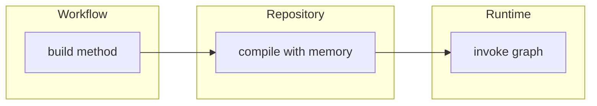
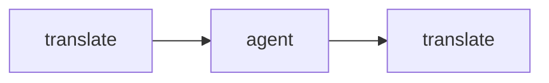
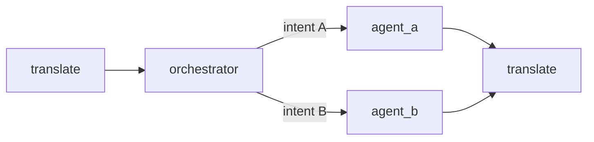

# Workflows

LangGraph workflows that orchestrate agents.

## Location

`src/modules/workflows/`

## Overview

Workflows define graph structure (nodes, edges) but do NOT compile. Compilation with checkpointer + store is handled by [ChatbotRepository](../../repositories/chatbots.md).

## Architecture



## Available Workflows

| Workflow | Purpose | Documentation |
|----------|---------|---------------|
| ClientChatbotWorkflow | Internal BI chatbot | [client_chatbot/main.md](client_chatbot/main.md) |
| CustomerChatbotWorkflow | Customer shopping assistant | [customer_chatbot/main.md](customer_chatbot/main.md) |

## Base Class

See [base.md](base.md) for full documentation.

```python
from src.modules.workflows.base import BaseWorkflow

class MyWorkflow(BaseWorkflow):
    def build(self) -> StateGraph:
        graph = StateGraph(MyState)
        # Add nodes and edges
        return graph  # NOT compiled
```

## Workflow Patterns

### Fixed Flow (CustomerChatbot)



Simple linear flow where every query follows same path.

### Conditional Flow (ClientChatbot)



Uses conditional edges to route based on classified intent.

## Files

```
src/modules/workflows/
├── base.py                    # BaseWorkflow class
├── client_chatbot/
│   ├── __init__.py
│   ├── state.py               # ClientChatbotState
│   └── main.py                # ClientChatbotWorkflow
└── customer_chatbot/
    ├── __init__.py
    ├── state.py               # ShoppingState
    └── main.py                # CustomerChatbotWorkflow
```

## Documentation

| Document | Description |
|----------|-------------|
| [base.md](base.md) | BaseWorkflow abstract class |
| [client_chatbot/main.md](client_chatbot/main.md) | Client workflow implementation |
| [client_chatbot/state.md](client_chatbot/state.md) | Client state definition |
| [customer_chatbot/main.md](customer_chatbot/main.md) | Customer workflow implementation |
| [customer_chatbot/state.md](customer_chatbot/state.md) | Customer state definition |
