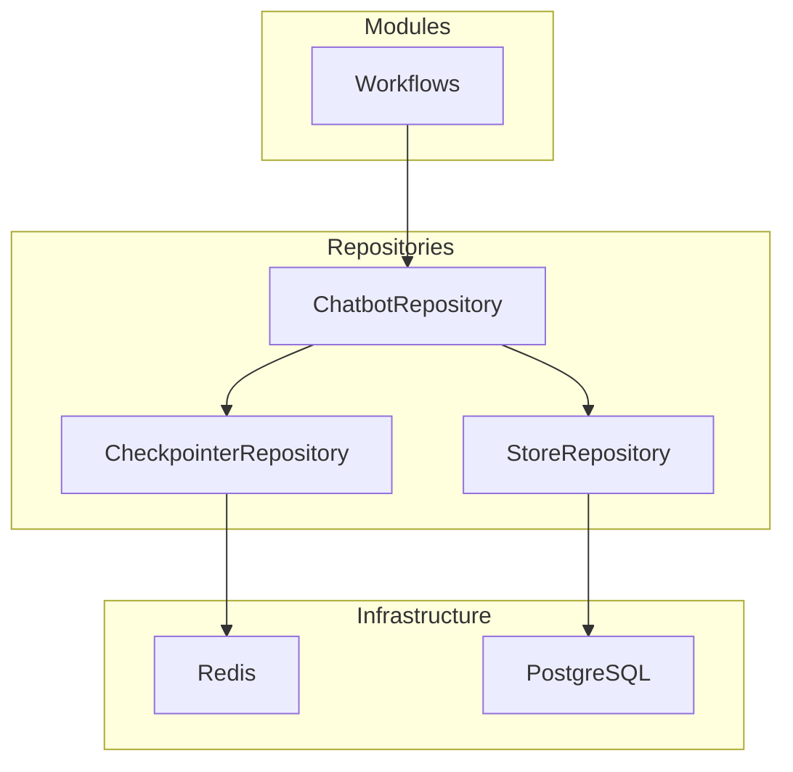
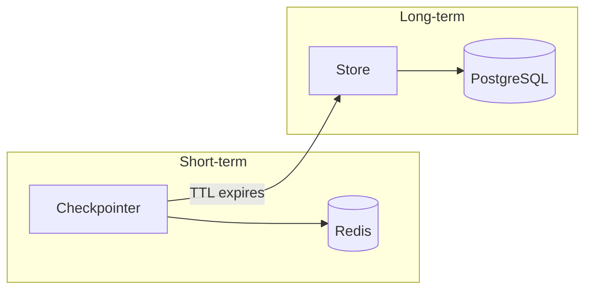

# Repositories

Domain-specific data access layer that abstracts infrastructure from business logic.

## Location

`src/repositories/`

## Overview

Repositories bridge the gap between modules (workflows/agents) and infrastructure (databases/caches).



## Components

| Repository | Purpose | Documentation |
|------------|---------|---------------|
| **Chatbots** | Compile workflow + memory management | [chatbots/README.md](chatbots/README.md) |
| **Checkpointers** | Short-term memory (per-thread, TTL) | [checkpointers/README.md](checkpointers/README.md) |
| **Stores** | Long-term memory (cross-thread, permanent) | [stores/README.md](stores/README.md) |

## Repository vs libs/

| Layer | Scope | Example |
|-------|-------|---------|
| `libs/` | Generic infrastructure (cross-project) | `RedisClient`, `PostgresClient` |
| `repositories/` | Domain-specific (project-specific) | `CustomerChatbotRepository`, `RedisCheckpointerRepository` |

## Memory Architecture



| Type | Storage | TTL | Purpose |
|------|---------|-----|---------|
| Short-term | Redis Checkpointer | 60 min | Per-thread conversation state |
| Long-term | Postgres Store | Permanent | Backup, audit, cross-thread |

## Design Decisions

| Decision | Description | Link |
|----------|-------------|------|
| Checkpointer + Store | Why we use both memory types | [why_checkpointer_and_store.md](../../decisions/why_checkpointer_and_store.md) |

## File Structure

```
src/repositories/
├── chatbots/
│   ├── base.py                    # BaseChatbotRepository
│   ├── client/main.py             # ClientChatbotRepository
│   └── customer/main.py           # CustomerChatbotRepository
├── checkpointers/
│   ├── base.py                    # BaseCheckpointerRepository
│   ├── redis/main.py              # RedisCheckpointerRepository
│   └── memory/main.py             # MemoryCheckpointerRepository
└── stores/
    ├── base.py                    # BaseStoreRepository
    └── postgres/main.py           # PostgresStoreRepository
```
