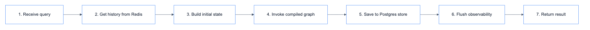

# **💼 ClientChatbotRepository**

Repository for internal BI chatbot.


---


## **📍 Location**

[`src/repositories/chatbots/client/main.py`](../../../../../src/repositories/chatbots/client/main.py)

---


## **💡 Purpose**

Compile ClientChatbotWorkflow with memory and provide invoke interface.


---


## **🔄 Code Flow**

<details>
<summary>📊 Code Flow</summary>



</details>


---


## **📋 Class Definition**

```python
class ClientChatbotRepository(BaseChatbotRepository):
    def __init__(
        self,
        workflow: ClientChatbotWorkflow,
        checkpoint_repo: Optional[BaseCheckpointerRepository] = None,
        store_repo: Optional[BaseStoreRepository] = None,
        observability: Optional[BaseObservability] = None,
    ):
        super().__init__(checkpoint_repo, store_repo)
        self.observability = observability
        
        # Compile graph with memory
        checkpointer = checkpoint_repo.checkpointer if checkpoint_repo else None
        store = store_repo.store if store_repo else None
        self.app = workflow.build().compile(checkpointer=checkpointer, store=store)
```


---


## **📥 Input/Output**


### 📥 **Input State**

| Field | Type | Description |
|-------|------|-------------|
| messages | list[BaseMessage] | History from checkpointer |
| query | str | User's raw input |
| user_language | None | Will be detected |
| translated_query | None | Will be translated |
| intent | None | Will be classified |
| response | None | Will be generated |
| chart_html | None | Will be generated if visualization |
| steps | [] | Tool execution trace |

### 📤 **Output State**

| Field | Type | Description |
|-------|------|-------------|
| response | str | Final response in user's language |
| chart_html | str | Plotly HTML (if visualization query) |
| steps | list[dict] | Tool calls and results |
| intent | Intent | CHAT_HISTORY or INSIGHT |


---


## **🔗 Workflow Reference**

| Component | Documentation |
|-----------|---------------|
| ClientChatbotWorkflow | [workflows/client_chatbot/main.md](../../../modules/workflows/client_chatbot/main.md) |
| ClientChatbotState | [workflows/client_chatbot/state.md](../../../modules/workflows/client_chatbot/state.md) |


---


## **💡 Usage**

```python
from src.repositories.chatbots.client.main import ClientChatbotRepository

repo = ClientChatbotRepository(
    workflow=workflow,
    checkpoint_repo=redis_checkpoint_repo,
    store_repo=postgres_store_repo,
    observability=langfuse_observability,
)

result = repo.invoke(
    query="ยอดขายเดือนนี้แยกตาม category",
    thread_id="thread-123",
    user_id="user-456",
)

print(result["response"])  # Thai response
print(result["chart_html"])  # Plotly chart HTML
```
