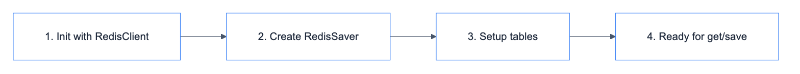

# **🗄️ RedisCheckpointerRepository**

Redis-based checkpointer with TTL support.


---


## **📍 Location**

[`src/repositories/checkpointers/redis/main.py`](../../../../../src/repositories/checkpointers/redis/main.py)

---


## **💡 Purpose**

Provide short-term memory for conversations using Redis with automatic expiration.


---


## **🔄 Code Flow**

<details>
<summary>📊 Code Flow</summary>



</details>


---


## **📋 Class Definition**

```python
class RedisCheckpointerRepository(BaseCheckpointerRepository):
    def __init__(
        self,
        redis_client: BaseKeyValueClient,
        ttl: int = 60,
        refresh_on_read: bool = True,
    ):
        ttl_config = {
            "default_ttl": ttl,
            "refresh_on_read": refresh_on_read,
        }
        self._checkpointer = RedisSaver(
            redis_client=redis_client.get_client(),
            ttl=ttl_config,
        )
        self._checkpointer.setup()
```


---


## **⚙️ Configuration**

| Config | Default | Description |
|--------|---------|-------------|
| ttl | 60 | Time-to-live in minutes |
| refresh_on_read | true | Extend TTL on each read |


---


## **🔧 Methods**


### 🔌 **checkpointer → BaseCheckpointSaver**

Get underlying RedisSaver for workflow compilation.

```python
@property
def checkpointer(self) -> BaseCheckpointSaver:
    return self._checkpointer
```

### 📥 **get_checkpoint() → CheckpointTuple**

Get checkpoint for a thread.

```python
def get_checkpoint(self, thread_id: str) -> Optional[Any]:
    config = {"configurable": {"thread_id": thread_id}}
    return self._checkpointer.get_tuple(config)
```

### 🗑️ **delete_checkpoint() → None**

Delete checkpoint (handled by TTL expiration).

```python
def delete_checkpoint(self, thread_id: str) -> None:
    # RedisSaver handles expiration via TTL
    pass
```


---


## **💡 Usage**

```python
from libs.database.key_value.redis.main import RedisClient
from src.repositories.checkpointers.redis.main import RedisCheckpointerRepository

redis_client = RedisClient(host="localhost", port=6379)
checkpoint_repo = RedisCheckpointerRepository(
    redis_client=redis_client,
    ttl=60,  # 60 minutes
    refresh_on_read=True,
)

# Get checkpointer for workflow compilation
checkpointer = checkpoint_repo.checkpointer

# Get conversation state
checkpoint = checkpoint_repo.get_checkpoint("thread-123")
if checkpoint:
    messages = checkpoint.checkpoint["channel_values"]["messages"]
```


---


## **🔗 Infrastructure**

| Component | Documentation |
|-----------|---------------|
| RedisClient | [libs/database/key_value/redis.md](../../../../libs/database/key_value/redis.md) |
| Docker Redis | [docker/redis.md](../../../../infrastructure/docker/redis.md) |
