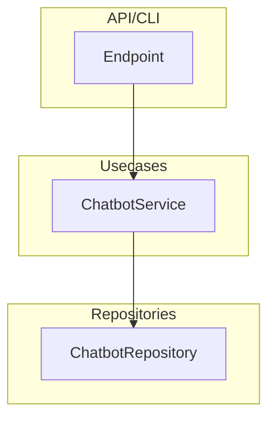

# Usecases

Application business logic layer.

## Location

`src/usecases/`

## Overview

Usecases orchestrate repositories to implement business operations. They are thin wrappers that delegate to repositories.



## Available Usecases

| Usecase | Purpose | Documentation |
|---------|---------|---------------|
| ChatbotService | Generic chatbot operations | [chatbot_service.md](chatbot_service.md) |

## Why Usecase Layer?

| Benefit | Description |
|---------|-------------|
| Abstraction | API doesn't know about repository internals |
| Testability | Easy to mock for unit tests |
| Extensibility | Add business logic without changing API/repo |

## File Structure

```
src/usecases/
├── __init__.py
└── chatbot/
    ├── __init__.py
    └── main.py              # ChatbotService
```

## References

- [Repositories](../repositories/README.md) - Data access layer
- [Dependencies](../dependencies/README.md) - DI wiring
